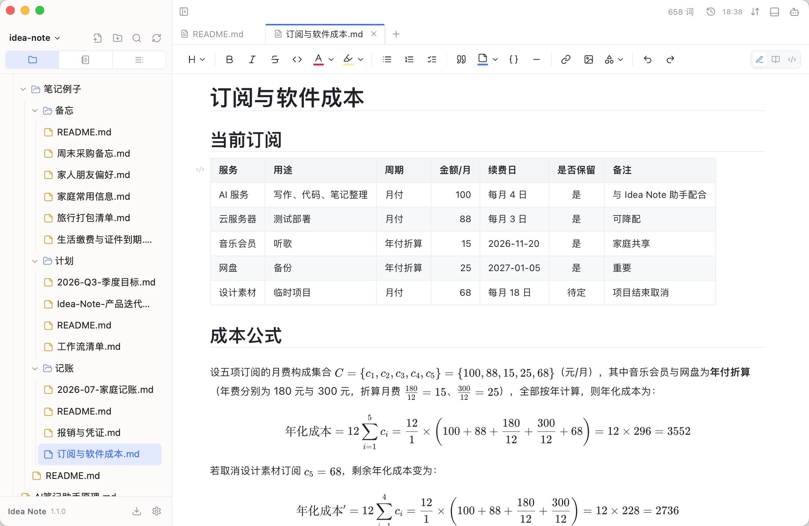
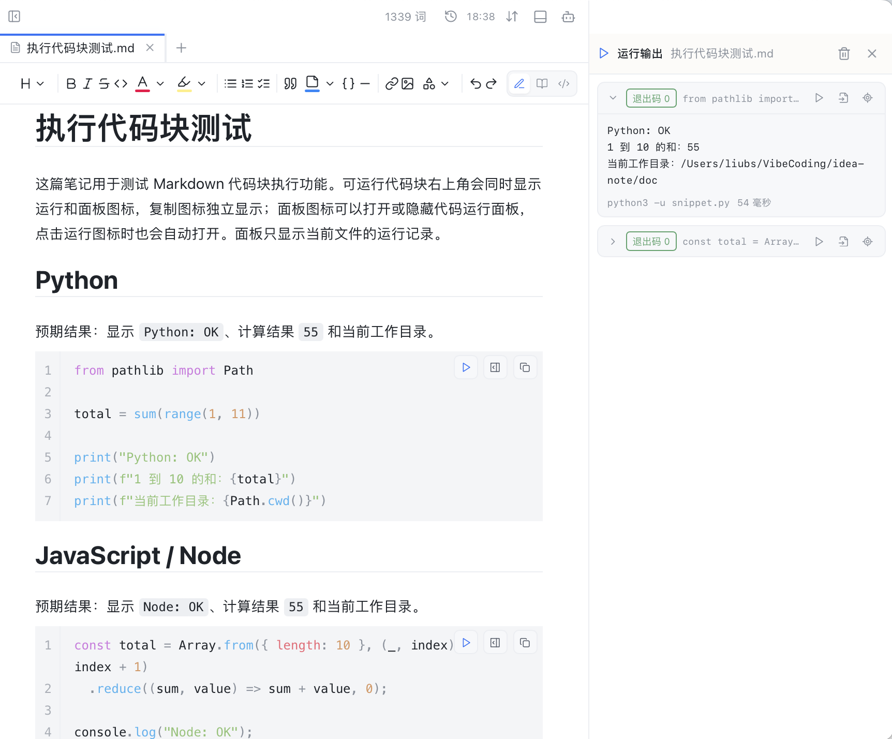
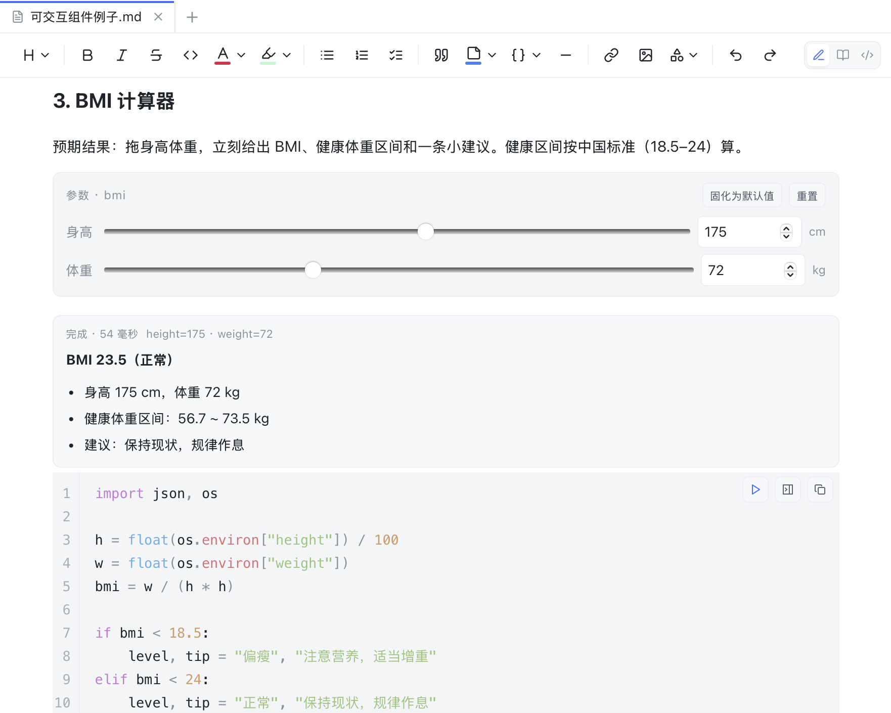
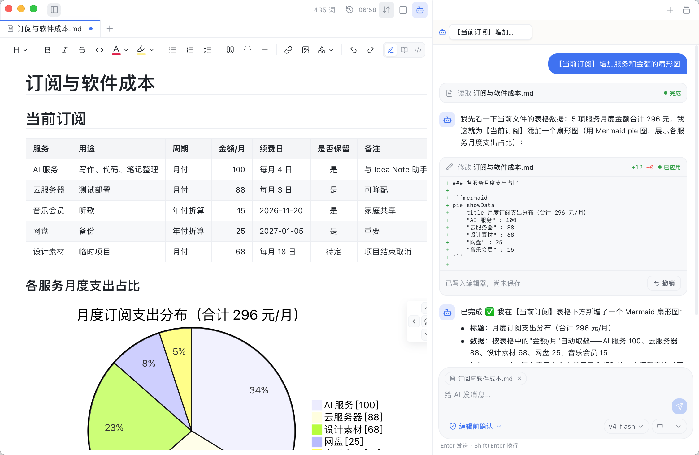
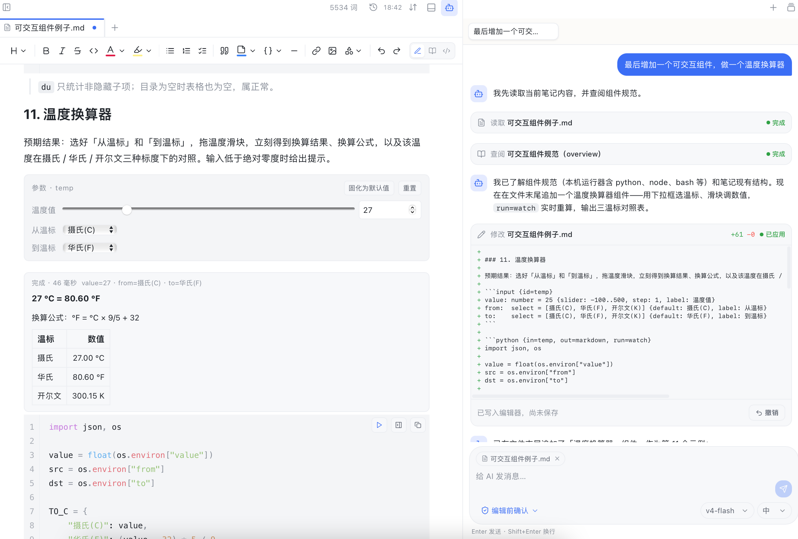
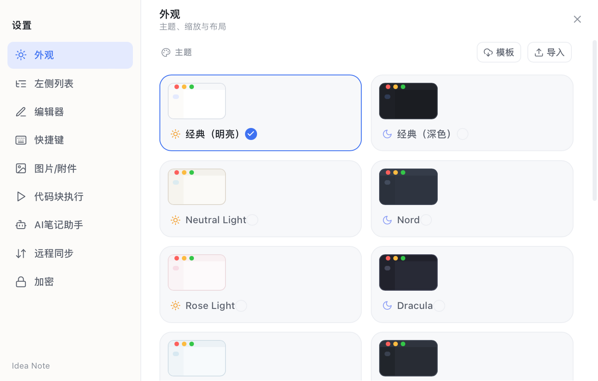

# Idea Note

[简体中文](./README.md) | **English**

<p align="center">
  
</p>

<p align="center">
  
  
  
</p>
<p align="center">
  <a href="https://github.com/Liubsyy/idea-note/releases/latest"></a>
  <a href="https://github.com/Liubsyy/idea-note/releases"></a>
</p>

**Idea Note** is a lightweight notes application combining a Markdown editor, an AI assistant, code execution, content encryption, and Git synchronization. Available for Windows, macOS, and Linux.



## Features

- **Markdown editor**: live preview with math, Mermaid diagrams, HTML/SVG rendering, an outline, and a formatting toolbar.
- **Runnable code blocks**: execute code directly from Markdown with one click.
- **Interactive components**: embed tools and input controls directly in your notes.
- **Encryption**: encrypt and decrypt selected sections of a note.
- **File management**: edit other text files alongside Markdown and use the app as a lightweight project file manager.
- **AI assistant**: ask questions, summarize and polish the current note, or use tools to read, search, create, edit, and delete notes. The assistant can also create interactive components.
- **Built-in tools**: Git sync, a terminal, PDF export, and printing.
- **Chinese and English**: the first launch detects your system language. Switch at any time in **Settings → Appearance → Language**; changes apply immediately to all open windows and are remembered after restart.

See the [changelog](./CHANGELOG.md) for release notes. The newest entry is available in Chinese and English.

## Usage

### Installation

Download an installer or portable package for your platform:

| Platform | Downloads | Notes |
| :--- | :--- | :--- |
| **Windows** | **x64**: [Installer](https://github.com/Liubsyy/idea-note/releases/latest/download/Idea.Note_1.2.4_windows_x64_setup.exe) \| [Portable](https://github.com/Liubsyy/idea-note/releases/latest/download/Idea.Note_1.2.4_windows_x64.zip)<br>**x86**: [Installer](https://github.com/Liubsyy/idea-note/releases/latest/download/Idea.Note_1.2.4_windows_x86_setup.exe) \| [Portable](https://github.com/Liubsyy/idea-note/releases/latest/download/Idea.Note_1.2.4_windows_x86.zip) | Choose x64 for most computers; x86 for 32-bit Windows |
| **macOS** | **Apple Silicon**: [Installer](https://github.com/Liubsyy/idea-note/releases/latest/download/Idea.Note_1.2.4_macos_aarch64.dmg) \| [App archive](https://github.com/Liubsyy/idea-note/releases/latest/download/Idea.Note_1.2.4_macos_aarch64.app.tar.gz)<br>**Intel**: [Installer](https://github.com/Liubsyy/idea-note/releases/latest/download/Idea.Note_1.2.4_macos_x64.dmg) \| [App archive](https://github.com/Liubsyy/idea-note/releases/latest/download/Idea.Note_1.2.4_macos_x64.app.tar.gz) | Choose Apple Silicon for M-series chips or Intel for Intel Macs |
| **Linux** | **Installers**: [deb](https://github.com/Liubsyy/idea-note/releases/latest/download/Idea.Note_1.2.4_linux_amd64.deb) \| [rpm](https://github.com/Liubsyy/idea-note/releases/latest/download/Idea.Note_1.2.4_linux_x86_64.rpm)<br>**Portable**: [AppImage](https://github.com/Liubsyy/idea-note/releases/latest/download/Idea.Note_1.2.4_linux_amd64.AppImage) | deb for Ubuntu/Debian/Linux Mint; rpm for Fedora/RHEL/CentOS Stream/openSUSE |

If macOS reports that the application cannot be opened or is damaged on first launch:

1. Open **System Settings → Privacy & Security**, find the blocked application, and click **Open Anyway**.
2. If that does not work, run the following command in Terminal, then reopen the app:

```bash
xattr -rd com.apple.quarantine /Applications/Idea\ Note.app
```

### Managing notes

The sidebar provides three views:

- **Files**: browse the complete file tree; create, rename, and organize files and folders by dragging. Edit plain text and view images alongside your notes.
- **Notes**: show only Markdown notes, either as cards or a tree.
- **Outline**: browse headings in the current note and click one to jump to it.

The editor uses live preview: placing the cursor inside a formula, table, Mermaid diagram, or similar block reveals its source for editing. Moving away renders it again. Switch between **Edit**, **Read-only**, and **Source** in the top-right corner of each Markdown editor.

The toolbar inserts headings, bold/italic/strikethrough text, lists, task lists, and Mermaid flowcharts, sequence diagrams, Gantt charts, and more. Pasted images and files are saved as attachments; their destination directories are configurable in Settings.

### Running code blocks

Click the Run icon at the top-right of a code block to execute it on your computer. Output streams into the separate **Run output** panel, which groups runs by the current file. Stop or rerun a program, jump to its code block, or insert the result into your note as an `output` block.

Supported runners include Python, JavaScript/Node, Ruby, Perl, Bash, PowerShell, Windows Batch/CMD, and custom runners.



### Interactive components

Place an input control block above runnable code to turn a note into an interactive tool. Move a slider, edit a number, or choose a date to rerun the script locally and render the result back into the note, without opening a terminal or editing code.



Choose **Code block → Interactive component** in the toolbar to generate a starting template, or write one manually. A component consists of an optional `input` block and a runnable code block with attributes.

- **Controls**: `number` (with optional slider), `text`, `bool`, `select`, `file`, `date`, `time`, and `datetime`. Values reach scripts through environment variables.
- **Data sources**: `in=` can reference an input block, a table in the note (such as `in=table:Schedule`), or a workspace file (such as `in=file:./sales.csv`).
- **Output**: `out=` supports Markdown, tables, JSON, Mermaid, HTML, images, and more. The script emits a JSON result as its final stdout line.
- **Triggers**: `run=watch` reruns on input changes; `run=open` refreshes on opening the note. Omit triggers for manual execution.

See the [component specification](./doc/可交互组件规范.md) and [ready-to-use examples](./doc/可交互组件例子.md), including password generators, function plotters, and commit heatmaps. These detailed guides are currently in Chinese.

### AI assistant

Click the robot icon in the title bar to open the AI panel. Add a model provider in Settings: Anthropic, OpenAI, and compatible services are supported, with custom Base URLs, API keys, and model IDs. Switch models and reasoning effort during a conversation.



The assistant can see the attached current note and answer questions, summarize, or polish it. Its tools search the workspace, read files, and create, edit, or delete notes. The default **Confirm before editing** mode lets you review changes before they are applied; automatic editing is also available. Multiple sessions and conversation history are supported.

The assistant can create **interactive components**, too. Ask it to add an interactive temperature converter: it consults the component specification and locally enabled runners, then writes the input and code blocks into your note so changing an input recalculates the result.



Learn more in the [AI assistant implementation guide](./doc/AI笔记助手原理.md) and [DeepSeek setup guide](./doc/AI笔记助手接入DeepSeek步骤.md) (Chinese).

### Encrypting notes

Set a workspace password in **Settings → Encryption**, select the content to protect, and choose **Encrypt as block** or **Encrypt inline** from the context menu. Content is stored as ciphertext in the Markdown file and must be unlocked before viewing or editing. Lock it immediately or configure how long the password remains valid in the session.

The password itself is never stored. Initial setup generates a recovery code shown only once; keep it in a password manager or another safe place. If both the password and recovery code are lost, the encrypted content cannot be recovered. Settings also lets you change the password, regenerate the recovery code, or reset the master key.

When using Git sync, commit `.ideanote/vault.json` with the workspace. It contains password-protected keys, not plaintext note content. Enter the same password on another device to unlock synced encrypted content.

### Git sync and history

Configure sync in **Settings → Remote sync**. Command-line Git must be installed. Two modes are available:

- **Local only**: initialize a local Git repository and save changes as committed snapshots without pushing to a remote. You can connect a remote later.
- **Remote sync**: connect any GitHub, Gitee, or self-hosted repository, or clone a repository as a new notebook. Automatic sync runs **commit → pull and merge → push** at a configured interval of 1–60 minutes. Manual sync is available at any time.

When both sides edit the same location, both versions remain in the file with `<<<<<<<` conflict markers. Resolve the conflict and sync again. An optional HTTP proxy applies only during sync and does not change global Git configuration.

Click the history icon in the title bar to review a note’s changes with side-by-side diffs, or switch to project history to browse commits across the workspace.

### Built-in terminal

Click the terminal icon in the title bar to open the bottom panel. Run commands in the workspace directory, execute scripts, and use Git without leaving the application.

### PDF export

Choose **Export PDF** from a sidebar file’s context menu. The system WebView generates a PDF through silent printing, with outline bookmarks and the same math, diagrams, and syntax highlighting as the application. No additional components are required.

### Settings



Open Settings using the gear icon at the bottom of the sidebar:

- **Appearance**: Chinese/English language, light/dark themes, accent colors, interface zoom, compact layout, and custom theme JSON imports.
- **Sidebar**: font size and weight for each view.
- **Editor**: font family, size, weight, line height, and heading scale.
- **Keyboard shortcuts**: customize editor shortcuts.
- **Images / attachments**: save pasted files beside the note, under the project root, or in an absolute directory.
- **Code execution**: enabled languages, interpreter commands, timeouts, and output limits.
- **AI assistant**: providers, API keys, font size, and session history limit.
- **Remote sync**: Git repository and sync proxy.
- **Encryption**: workspace password and its lifetime, immediate locking, password changes, recovery code regeneration, and master-key reset.

## Development and builds

### Technology stack

- Frontend: React 19, TypeScript, Vite 8, CodeMirror 6, Zustand, and Tailwind CSS.
- Desktop framework: Tauri 2.
- Backend: Rust.

### Requirements

- A recent Node.js LTS release.
- A recent stable Rust toolchain.

### Project structure

- `src/`: React frontend and application logic; `components/` contains UI components, `lib/codemirror/` contains editor extensions, `lib/ai/` contains AI clients and tools, `i18n/` contains language support, and `store/` contains Zustand state.
- `src-tauri/`: Tauri desktop and Rust backend commands for files, Git, search, terminals, printing, and more.
- `doc/`: documentation and Markdown examples.

### Local development

Install dependencies:

```bash
npm install
```

Start the desktop development application:

```bash
npm run tauri:dev
```

Development uses the separate application identifier `com.liubs.idea-note.dev`, allowing it to run alongside production with a separate data directory.

Build a release package:

```bash
npm run tauri build
```

### Local AI test service

Run `npm run mock:ai` for a deterministic test service requiring no API key. Configure Base URL `http://127.0.0.1:11435/v1` and model ID `idea-note-test`. See the [test service guide](./mock-ai/README.md).

### Common commands

| Command | Description |
| --- | --- |
| `npm install` | Install frontend dependencies |
| `npm run dev` | Start the frontend development server |
| `npm run tauri:dev` | Start desktop development with a separate application identifier |
| `npm run preview` | Preview the frontend build |
| `npm run mock:ai` | Start the local deterministic AI service |
| `npm run test:mock-ai` | Test the local AI service |
| `npm run test:i18n` | Verify translations and language switching |
| `npm run build` | Type-check TypeScript and build the frontend |
| `npm run tauri build` | Build desktop installers |
| `cargo check --manifest-path src-tauri/Cargo.toml` | Check Rust / Tauri code |
| `cargo test --manifest-path src-tauri/Cargo.toml` | Run Rust unit tests |

### Package information

- Application name: `Idea Note`.
- Application identifier: `com.liubs.idea-note`.
