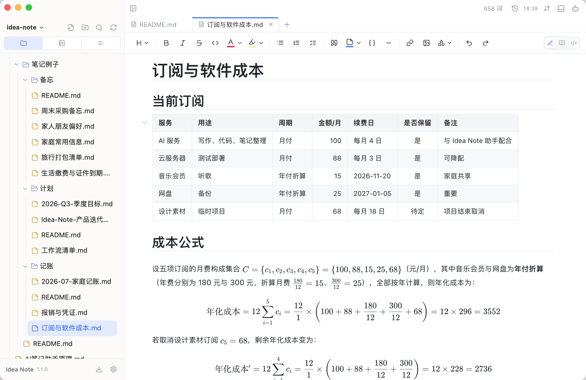
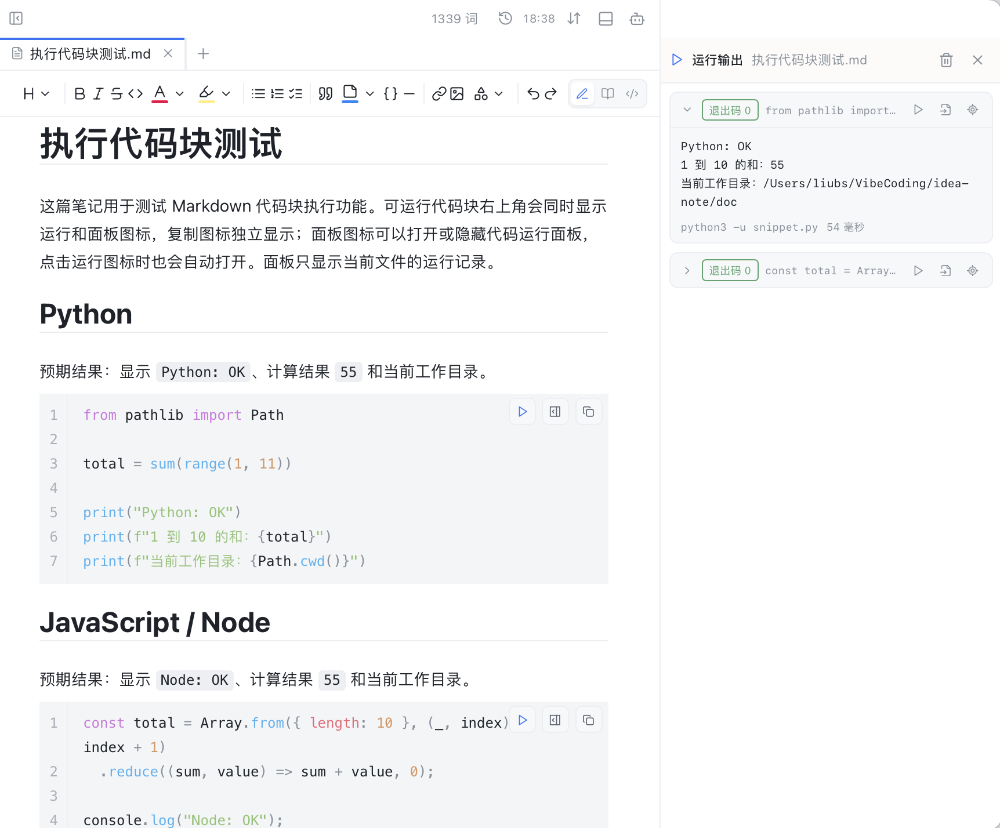
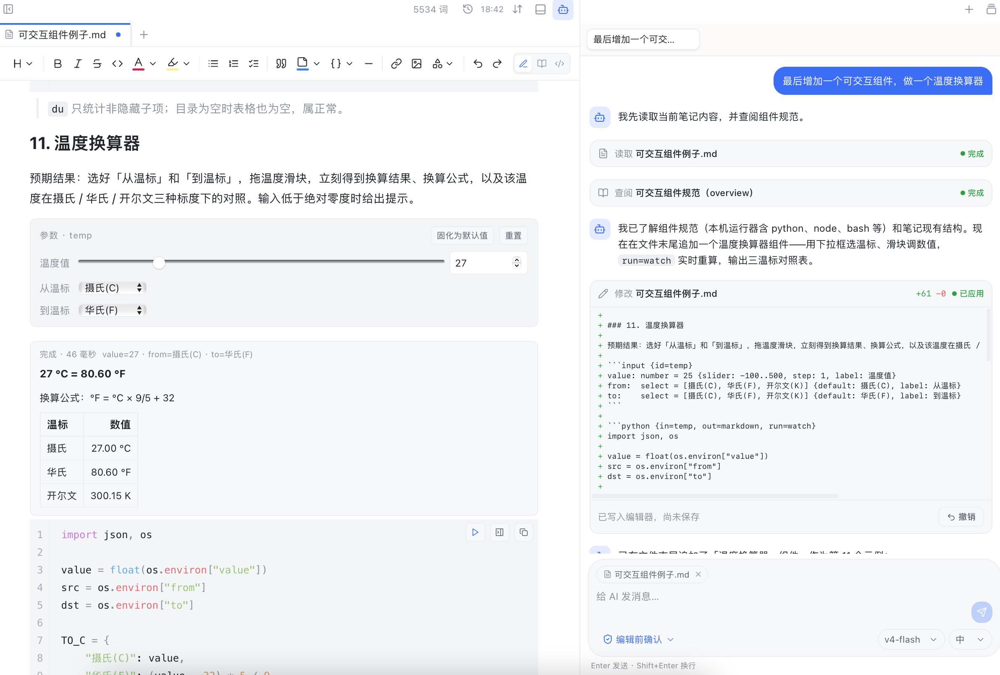
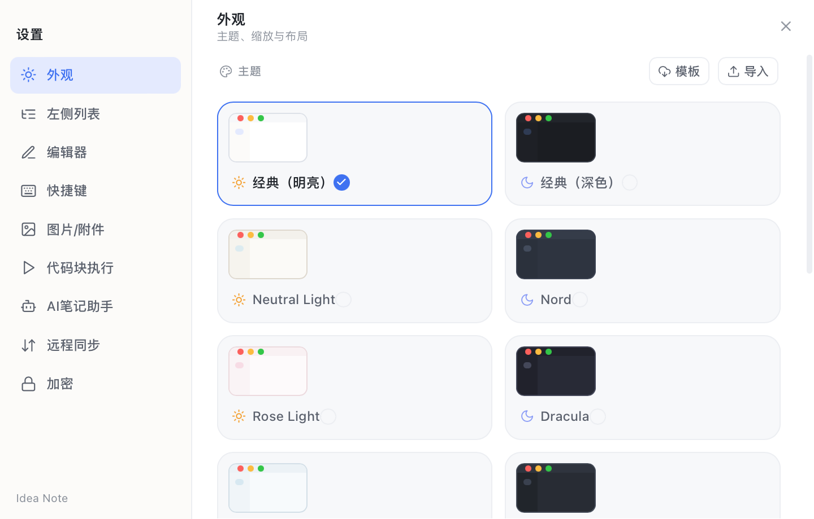

# Idea Note

<p align="center">
  
</p>

<p align="center">
  
  
  
</p>
<p align="center">
  <a href="https://github.com/Liubsyy/idea-note/releases/latest"></a>
  <a href="https://github.com/Liubsyy/idea-note/releases"></a>
</p>

**Idea Note** 是一款轻量简洁的笔记应用，包含 **Markdown** 编辑器、文件管理器、 **AI 笔记助手**，支持**Git远程同步**，兼容 Windows、MacOS 和 Linux 平台。





## ✨ 功能特性
- **Markdown 编辑器**：所见即所得实时编辑，支持公式、Mermaid流程图、HTML/SVG渲染、大纲、工具栏。
- **执行代码块**：markdown中的的代码块一键直接执行。
- **可交互组件**：直接在markdown中做可直接交互的小工具。
- **文件管理**：除markdown外还可编辑其他文本文件，可作为轻量级项目文件管理器。
- **AI 笔记助手**：用自然语言对当前笔记进行问答、总结、润色，并通过工具直接读取、搜索、新建、编辑或删除笔记，还能按需写出可交互组件。
- **内置工具**：内置git远程同步、终端。
- **导出**：支持导出PDF和打印。

## 📖 使用说明

### ⬇️ 安装

根据平台下载桌面安装包或发行文件

| 系统 | 文件 | 说明 |
| :--- | :--- | :--- |
| **Windows** | **x64**：[安装包](https://github.com/Liubsyy/idea-note/releases/latest/download/Idea.Note_1.1.2_windows_x64_setup.exe) \| [免安装包](https://github.com/Liubsyy/idea-note/releases/latest/download/Idea.Note_1.1.2_windows_x64.zip)<br>**x86**：[安装包](https://github.com/Liubsyy/idea-note/releases/latest/download/Idea.Note_1.1.2_windows_x86_setup.exe) \| [免安装包](https://github.com/Liubsyy/idea-note/releases/latest/download/Idea.Note_1.1.2_windows_x86.zip) | 大多数电脑选 x64<br>32 位系统选 x86 |
| **MacOS** | **Apple Silicon**：[安装包](https://github.com/Liubsyy/idea-note/releases/latest/download/Idea.Note_1.1.2_macos_aarch64.dmg) \| [应用包压缩](https://github.com/Liubsyy/idea-note/releases/latest/download/Idea.Note_1.1.2_macos_aarch64.app.tar.gz)<br>**Intel**：[安装包](https://github.com/Liubsyy/idea-note/releases/latest/download/Idea.Note_1.1.2_macos_x64.dmg) \| [应用包压缩](https://github.com/Liubsyy/idea-note/releases/latest/download/Idea.Note_1.1.2_macos_x64.app.tar.gz) | M芯片选 Apple Silicon<br>Intel 芯片选 Intel  |
| **Linux** | **安装包**：[deb](https://github.com/Liubsyy/idea-note/releases/latest/download/Idea.Note_1.1.2_linux_amd64.deb) \| [rpm](https://github.com/Liubsyy/idea-note/releases/latest/download/Idea.Note_1.1.2_linux_x86_64.rpm)<br>**免安装**：[AppImage](https://github.com/Liubsyy/idea-note/releases/latest/download/Idea.Note_1.1.2_linux_amd64.AppImage) | Ubuntu/Debian/Linux Mint选deb<br>Fedora/RHEL/CentOS Stream/openSUSE选rpm |

MacOS 首次安装时如果遇到"无法打开"或"应用已损坏"之类的权限提示，可按下面方式处理：

1. "系统设置 -> 隐私与安全性"中找到被拦截的应用，点击"仍要打开"
2. 如果第1种方式不行，可以在终端执行以下命令后重新打开
```
xattr -rd com.apple.quarantine /Applications/Idea\ Note.app
```

### 📝 笔记管理

左侧列表提供三种视图：
- **文件模式**：完整文件树，可新建、重命名、拖拽整理文件与文件夹，也能编辑普通文本、查看图片，当作轻量的项目文件管理器使用
- **笔记模式**：只显示 Markdown 笔记，支持卡片和树形两种展示方式，专注于笔记本身
- **预览大纲**：当前笔记的标题大纲，点击标题即可跳转


正文采用所见即所得的实时预览：光标点进公式、表格、Mermaid 图表等块时显示源码方便编辑，移开光标即渲染成型。每个markdown右上角可在三种模式（**编辑/只读/源码**）间切换。

顶部工具栏可一键插入标题、加粗 / 斜体 / 删除线、列表与任务列表等，以及流程图、时序图、甘特图等各类 Mermaid 图表。粘贴的图片和文件会自动保存为附件（保存目录可在设置中配置）。


### ▶️ 运行代码块

在代码块右上角点击运行图标，程序在本机执行，输出实时显示在独立的"运行输出"面板里。面板按当前文件显示运行记录，可停止、重跑、跳回代码块，或把结果作为 ```output 块插入笔记。

> 支持 Python、JavaScript/Node、Ruby、Perl、Bash、PowerShell、Windows Batch/CMD 以及自定义执行器




### 🕹️ 可交互组件

在运行代码块之上再加一层：给代码块配一个参数块，笔记就变成了一个小工具。读者拖滑块、改数字、选日期，脚本就在本机重跑一遍，结果直接渲染回笔记里——不用打开终端，也不用改代码。


工具栏「代码块」菜单里的「可交互组件」可以直接生成骨架，也可以手写。一个组件 = 一个 `input` 参数块（可选）+ 一个带属性的可运行代码块。

- **参数控件**：`number`（可配滑块）、`text`、`bool`、`select`、`file`、`date`、`time`、`datetime` 八种，值通过环境变量交给脚本。
- **数据来源**：`in=` 除了参数块，还能直接绑定笔记里的表格（`in=table:排期`）或工作区里的文件（`in=file:./sales.csv`）。
- **输出渲染**：`out=` 支持 markdown、table、json、mermaid、html、image 等，脚本只需在标准输出的最后打一行 JSON。
- **触发方式**：`run=watch` 参数一改就重算，`run=open` 打开笔记就刷新，不写则手动点运行。

完整语法见 [doc/可交互组件规范.md](./doc/可交互组件规范.md)，十几个现成例子（密码生成器、函数绘图仪、提交热力图等）见 [doc/可交互组件例子.md](./doc/可交互组件例子.md)。


###  AI 笔记助手

点击标题栏机器人图标打开 AI 笔记助手面板。在设置中添加模型服务即可使用：支持 Anthropic、OpenAI 以及任何兼容两者接口的服务（自定义 Base URL、API Key 和模型 ID），对话中可随时切换模型与思考级别。


助手能看到当前打开的笔记，可以直接问答、总结、润色；它还内置一组笔记工具，可以搜索工作区、读取任意笔记，并新建、编辑、删除笔记。所有修改操作默认"编辑前确认"，逐条审阅后再生效，也可切换为自动执行。会话支持多开并保留历史，随时回看或删除。

助手也会写**可交互组件**：说一句"给这篇笔记加一个可交互组件：温度换算器"，它会先查阅组件规范（同时确认本机启用了哪些运行器），再把参数块和可运行代码块直接写进笔记，参数一拖结果就重算。

   


实现原理见 [doc/AI笔助手原理.md](./doc/AI笔记助手原理.md)。

接入AI模型可参考： [doc/AI笔记助手接入DeepSeek步骤.md](./doc/AI笔记助手接入DeepSeek步骤.md)。


### 🔄 Git 同步与历史记录

在"设置 → 远程同步"中配置，基于命令行 git 实现（需已安装 git），支持两种方式：

- **仅本地**：将工作区初始化为本地 git 仓库，修改自动提交为版本快照，不推送到任何远程，之后可随时升级为远程同步
- **远程同步**：关联 GitHub / Gitee / 自建等任意远程仓库，或直接克隆一个远程仓库作为新笔记库；开启自动同步后按设定间隔（1–60 分钟）在后台自动执行"提交 → 拉取合并 → 推送"，也可随时手动同步

两端修改了同一处时，双方内容都会以 `<<<<<<<` 标记保留在文件中，整理后再次同步即可，不会丢失内容。网络受限时可配置仅同步时生效的 HTTP 代理，不写入 git 全局配置。

点击标题栏历史图标，可查看当前笔记的每一次变更并左右对比差异，也可切换到全局历史浏览整个工作区的提交记录。

### 🖥️ 内置终端

点击标题栏终端图标可打开底部终端面板，直接在工作区目录下执行命令，运行脚本、使用 git 等都无需离开应用。


### 📄 导出 PDF

在侧栏文件右键菜单中选择"导出 PDF"，通过系统 WebView 静默打印直接生成 PDF 文件，自动附带书签大纲，公式、图表、代码高亮与应用内显示一致，无需安装任何额外组件。

### ⚙️ 设置





在侧栏底部齿轮图标打开设置窗口，包含以下配置项：

- **外观**：明暗主题与主题色、界面缩放、紧凑排版，支持导入自定义主题 JSON
- **左侧列表**：各视图的字体大小与字重
- **编辑器**：字体、字号、字重、行高与标题缩放
- **快捷键**：自定义编辑器快捷键
- **图片/附件**：粘贴图片与文件的保存目录（笔记目录 / 工程目录 / 绝对目录）
- **代码执行**：可运行的代码块语言、解释器命令与超时、输出上限
- **AI 笔记助手**：模型服务、API Key 与字号
- **远程同步**：Git 仓库与同步代理


## 🛠️ 开发与构建

### 📚 技术栈

- 前端：`React 19`、`TypeScript`、`Vite 8`、`CodeMirror 6`、`Zustand`、`Tailwind CSS`
- 桌面端：`Tauri 2`
- 后端逻辑：`Rust`

### 🖥️ 环境要求

- Node.js：建议使用较新的 LTS 版本
- Rust：较新的稳定版

### 📂 目录结构

- `src/`：React 前端界面与页面逻辑
  - `components/`：侧栏、编辑器、面板、设置等 UI 组件
  - `lib/codemirror/`：实时预览、公式、图表等编辑器扩展
  - `lib/ai/`：AI 笔记助手客户端与工具
  - `store/`：Zustand 全局状态
- `src-tauri/`：Tauri 桌面端与 Rust 后端实现（文件、Git、搜索、终端、打印等命令）
- `doc/`：文档与 Markdown 语法示例


### 💻 本地开发

#### 1. 安装依赖

```bash
npm install
```

#### 2. 启动桌面应用调试

```bash
npm run tauri:dev
```

调试版使用独立的应用标识 `com.liubs.idea-note.dev`，可与正式版同时运行，并且不共用应用数据目录。


#### 3. 构建正式包
```bash
npm run tauri build
```


#### 本地 AI 测试服务

无需 API Key 的固定问答服务可用 `npm run mock:ai` 启动，然后在 AI 模型设置中填写 Base URL `http://127.0.0.1:11435/v1`、模型 ID `idea-note-test`。详细说明见 [AI 测试服务](./mock-ai/README.md)。

### ⌨️ 常用命令

| 命令 | 说明 |
| --- | --- |
| `npm install` | 安装前端依赖 |
| `npm run dev` | 启动前端开发服务器 |
| `npm run tauri:dev` | 以独立应用标识启动桌面应用开发模式 |
| `npm run preview` | 预览前端构建产物 |
| `npm run mock:ai` | 启动本地固定问答 AI 测试服务 |
| `npm run test:mock-ai` | 测试本地 AI 测试服务 |
| `npm run build` | 执行 TypeScript 检查并构建前端 |
| `npm run tauri build` | 构建桌面应用安装包 |
| `cargo check --manifest-path src-tauri/Cargo.toml` | 检查 Rust / Tauri 侧代码 |
| `cargo test --manifest-path src-tauri/Cargo.toml` | 运行 Rust 单元测试 |


### 📦 打包与资源说明

- 应用名称：`Idea Note`
- 应用标识：`com.liubs.idea-note`
