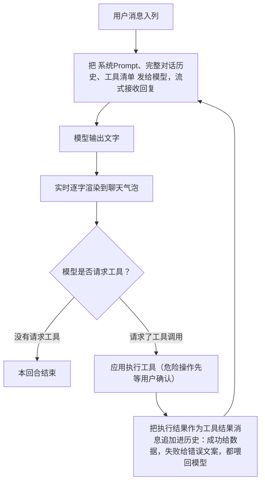

# AI 笔记助手原理

本文介绍右侧 AI 聊天面板的工作原理：给大模型发了什么 Prompt、模型如何"操作"笔记应用（工具调用）、以及用户与 AI 之间如何交互。

## 1. 一句话概括

AI 笔记助手本质上是一个**带工具的对话代理（Agent）**：

> 应用把"系统 Prompt + 对话历史 + 工具清单"发给大模型；模型既可以直接用文字回答，也可以请求调用某个工具（如"读取当前文件""搜索笔记""删除文件"）；应用执行工具后将结果返回给模型，模型据此继续思考，直到给出最终回答。

模型本身**不**能触碰任何文件——它只能"提出请求"，真正的读写删操作都由应用执行，危险操作（编辑、删除）还需经过用户点击确认。

## 2. 系统 Prompt：模型被告知了什么

每次用户发消息时，应用都会**实时生成**一段系统 Prompt（而不是固定写死），因此它总是反映"此刻打开的是哪个文件、哪个工作区"。完整的 Prompt 由三部分拼成：

### 2.1 身份设定（固定）

```
你是 Idea Note（一款 Markdown 笔记应用）的 AI 笔记助手，请用中文回答。
```

### 2.2 当前打开的文件（动态）

如果用户附加了当前打开的文件（聊天输入框上的回形针开关，默认开启）：

```
用户当前打开的文件是：/Users/xxx/notes/周报.md
你可以用工具读取和编辑这个打开的文件：用户说"当前文件""这篇""打开的文件"时调用 read_open_file；
做局部修改时优先用 edit_open_file（精确字符串替换）；需要大段重写时用 write_open_file。
你的修改只会写入编辑器缓冲区，是否保存由用户决定，因此可以放心修改。
```

如果没有打开文件（或用户关掉了附加开关）：

```
用户没有附加当前打开的文件。不要主动调用工具读取或修改打开的文件；
仅当用户在消息中明确要求读取或修改文件时，才使用 read_open_file / edit_open_file / write_open_file。
```

### 2.3 笔记工作区（动态）

如果打开了笔记工作区：

```
用户当前的笔记工作区是：/Users/xxx/notes
你还可以管理工作区中的笔记：用户明确提到某个文件名或路径并要求读取时，
调用 read_file 读取该指定文件，不要用 read_open_file 代替；
用户要新建笔记时调用 create_note；
要查找笔记时调用 search_notes（按关键词匹配文件名和内容）；
要删除文件或文件夹时调用 delete_file（应用会向用户弹出确认卡片，批准后才真正删除）。
读取或删除前如果不确定具体路径，先用 search_notes 找到目标文件；
这些工具中的路径均使用相对工作区根目录的路径。
```

如果没有打开工作区：

```
用户当前没有打开笔记工作区，无法新建、搜索或删除笔记；
如果用户需要这些功能，请提醒他先打开一个笔记文件夹。
```

### 2.4 Prompt 设计的两个用意

- **"修改只写入编辑器缓冲区，可以放心修改"**——告诉模型改动不会直接落盘，它就不会每次都先问"我可以改吗？"，而是直接动手，由应用的确认机制兜底。
- **"应用会向用户弹出确认卡片"**——提前告知删除有人工确认，模型就不会在对话里反复跟用户确认"你确定要删吗？"，删除流程因此只需一步自然语言指令。

## 3. 工具清单：模型能做的七件事

随每次请求一起发给模型的还有一份工具清单。每个工具包含名字、一段中文描述（模型靠它判断什么时候用哪个工具）和参数定义（JSON Schema）。模型看到的内容大致如下：

| 工具 | 模型看到的描述 | 参数 |
|---|---|---|
| `read_open_file` | 读取用户当前在编辑器中打开的文件的完整内容 | 无 |
| `read_file` | 按路径读取当前工作区中的某个文本文件。用户明确提到文件名或路径时使用；如果路径不确定，先用 search_notes 查找 | path |
| `edit_open_file` | 对当前打开的文件做精确字符串替换，old_string 必须与文件中的文本完全一致，优先用它做局部修改 | old_string、new_string、replace_all |
| `write_open_file` | 用全新内容整体替换当前打开文件，仅在需要大段重写时使用 | content |
| `create_note` | 在工作区中新建一篇 Markdown 笔记并在编辑器中打开，可选写入初始内容，同名报错 | name、dir、content |
| `delete_file` | 删除工作区中的文件或文件夹。执行前会向用户弹出确认卡片，批准后才真正删除。不确定路径时先用 search_notes 查找 | path |
| `search_notes` | 按关键词搜索笔记：匹配文件名和文本内容（不区分大小写），返回路径、行号和内容片段 | query |

`read_open_file`、`edit_open_file`、`write_open_file` 针对"当前打开的这一篇"；`read_file`、`create_note`、`delete_file`、`search_notes` 针对"整个笔记工作区"。这样自然语言就能覆盖日常笔记操作：

- "帮我润色这段" → 读取 + 编辑当前文件
- "读取 AI笔记助手原理.md，看看里面怎么描述工具调用" → read_file
- "新建一篇叫周报的笔记，写上待办模板" → create_note
- "我哪篇笔记提到过 Tauri？" → search_notes
- "把周报删了" → （可能先 search_notes 定位）→ delete_file

### 3.1 两种读取工具为什么同时存在

`read_open_file` 和 `read_file` 看起来都能"读文件"，但它们解决的是两个不同场景：

- **当前文件语义**：用户说"总结当前文件""修改这篇""看看我打开的内容"时，模型用 `read_open_file`。它读取的是编辑器里的实时内容，因此能看到尚未保存到磁盘的改动。
- **点名文件语义**：用户说"读取 x 文件""看看 doc/测试.md""对比 A 和 B"时，模型用 `read_file(path)`。这个工具会按路径读取工作区中的指定文件，不会被当前打开的是 y 文件干扰。

如果 `read_file(path)` 指向的正好就是当前打开文件，应用会自动返回编辑器里的实时内容，而不是磁盘上的旧内容。这样两个工具既分工清楚，又不会在未保存内容上产生割裂。

## 4. 工具调用是怎么跑起来的：多轮循环

一次用户提问可能引发模型多次"思考→调工具→再思考"，应用用一个循环来驱动（上限 20 轮，防止模型无限调用）：



几个关键设计：

- **对话历史是完整的**：用户消息、模型回复、模型的工具请求、工具执行结果，全部按顺序记入历史并随每轮请求重发，所以模型记得自己刚才搜到了什么、删没删成功，多轮对话和连续操作都自然成立。
- **失败也喂回去**：工具出错时（比如要替换的文字没匹配上、要删的文件不存在），错误文案同样作为结果返回给模型，模型会自己换个思路重试（换一段 old_string、先去搜索正确路径），而不是直接卡死。
- **文字和工具卡片交错展示**：模型在调工具前后说的话各自成段，中间插入工具执行卡片，用户能看到完整的"AI 说了什么 → 做了什么 → 结果如何"的过程。

### 一次"删除笔记"的完整过程

以用户说"把周报删了"为例：

1. 模型收到消息，先调用 `search_notes("周报")` —— 聊天里出现一张"搜索"卡片，显示命中数量；
2. 模型从结果中确定目标是 `周报.md`，发起 `delete_file("周报.md")`；
3. 聊天里出现一张红色待确认卡片："删除 周报.md —— 确认删除？此操作不可撤销"，**整个 AI 流程在此暂停**，等用户点击；
4. 用户点「确认删除」→ 应用真正删除文件、刷新文件树（若删的恰好是正在编辑的文件，编辑器同时清空），卡片状态变为"已删除"；模型收到"用户已确认，已删除"的结果，输出一句总结；
5. 若用户点「取消」→ 文件原封不动，卡片变"已拒绝"，模型收到"用户拒绝了删除"，会礼貌地确认不再操作。

## 5. 人机交互：确认、模式与撤销

### 5.1 流式输出

模型回复通过 SSE 流式传输，文字逐字出现在聊天气泡里，不必等整段生成完。

### 5.2 工具卡片

AI 的每个动作都在聊天流里留下一张卡片，带图标、动作名和状态徽标（处理中 / 完成 / 待确认 / 已应用 / 已拒绝 / 已删除 / 失败）：

- **读取 / 新建 / 搜索**：默认直接执行，卡片只展示结果状态；如果会话切到"每次询问"，也会先出现确认按钮；读取指定文件时，卡片标题显示目标路径或文件名；
- **修改**：卡片展示逐行 diff（绿色新增、红色删除，+N/−N 统计）；
- **删除**：卡片带「取消 / 确认删除」按钮。

### 5.3 三种操作确认模式

每个会话可在三种模式间切换：

- **编辑前确认（默认）**：读取、搜索、新建直接执行；AI 的每次修改都先以 diff 卡片呈现，用户点「应用」才写入，点「拒绝」则放弃（拒绝的事实也会告诉模型）；
- **自动编辑**：读取、搜索、新建直接执行；修改也直接写入编辑器，卡片上保留「撤销」按钮可一键还原；
- **每次询问**：AI 的任何工具动作都会等待用户确认，包括读取当前文件、读取指定文件、搜索、新建和修改；读取、搜索、新建在执行前确认，修改则先生成 diff、用户点「应用」后才写入。用户拒绝时，拒绝结果会返回给模型。

**删除不受模式影响**——无论哪种模式，删除永远弹确认卡片。文件删除不可逆，不允许 AI 静默执行。

### 5.4 修改是"安全"的

AI 对文件内容的修改只进入编辑器缓冲区（相当于你自己打字改了但还没保存），是否落盘由用户 Cmd+S 决定。这也是双保险之一：即使误应用了修改，不保存即可放弃。

### 5.5 等待确认的实现思路

待确认卡片出现时，AI 的工具循环被"冻结"在原地（一个等待用户点击的异步等待），用户点了按钮流程才继续。如果中途关闭应用，下次打开时这些悬而未决的卡片会被标记为"已中断"，不会留下点不动的僵尸按钮。

## 6. 安全边界

1. **工作区围栏**：模型给出的所有路径都会被归一化并校验必须落在当前工作区内。让 AI 删 `../外部文件` 只会得到"路径不在当前工作区内"的错误，工作区根目录本身也禁止删除。
2. **指定读取也受围栏限制**：`read_file` 只能读取当前工作区内的文本文件；图片、文件夹、二进制文件或工作区外路径都会返回错误。
3. **删除强制人工确认**：见上，任何模式下都不可绕过。
4. **修改不直接落盘**：只写编辑器缓冲区，保存权在用户手里。
5. **搜索结果限量**：全文搜索最多返回 50 条命中、单文件最多 3 行、每行片段最长 200 字符，既保护隐私面也避免把超长内容塞进模型上下文。
6. **调用轮数上限**：单次回合最多 20 轮工具调用，防止模型陷入死循环。

## 7. 多模型支持

助手不绑定某一家模型。用户在设置中配置若干模型（名称、API 地址、密钥），每个聊天会话可独立选择：

- **OpenAI 兼容协议**：OpenAI、DeepSeek、Kimi、OpenRouter、Ollama 等所有兼容 Chat Completions 的服务；
- **Anthropic 原生协议**：Claude 系列。

应用内部用一套统一的对话和工具格式，发请求时才转换成对应厂商的线格式（两家的工具调用、流式事件格式差异都在适配层消化），所以换模型不影响任何功能——同一套 Prompt 和工具清单对所有模型生效。每个会话还可以单独设置思考力度（低→最高）和是否附带当前打开的文件。

## 8. 请求与响应的格式和字段

下面分三层说明：应用内部的**统一格式**，以及它被翻译成的两种厂商**线格式**（OpenAI 兼容 / Anthropic 原生）。两个 `send()` 客户端把统一历史转成各自的 body，再把各自的流式事件归一回统一结果。

### 8.1 统一内部格式（与厂商无关）

应用内部不直接持有厂商 JSON，而是用一组归一化类型描述对话（`src/lib/ai/types.ts`）：

| 类型 | 字段 | 说明 |
|---|---|---|
| `ChatMsg`（user） | `role:"user"`、`content` | 用户文本消息 |
| `ChatMsg`（assistant） | `role:"assistant"`、`content`、`toolCalls?` | 模型回复，可同时带文字和工具请求 |
| `ChatMsg`（tool） | `role:"tool"`、`toolCallId`、`name`、`result` | 一次工具执行的结果 |
| `ToolCall` | `id`、`name`、`args`（已解析的 JSON 对象） | 模型发起的一次工具调用 |
| `ToolDef` | `name`、`description`、`parameters`（JSON Schema） | 工具清单中的一项 |
| `ProviderReply` | `text`、`toolCalls` | 一轮请求归一后的结果 |
| `ProviderOptions` | `thinkingLevel`、`signal?` | 思考力度（`low/medium/high/xhigh/max`）与中止信号 |

发请求时统一传入 `(model, history, tools, system, options, onTextDelta)`：`system` 是第 2 节那段实时拼出的系统 Prompt，`history` 是完整 `ChatMsg[]`，`tools` 是第 3 节的七个 `ToolDef`，`onTextDelta` 用于把流式文字逐字回灌到聊天气泡。

### 8.2 OpenAI 兼容协议

**端点**：`POST {baseUrl}/chat/completions`（`baseUrl` 含版本段，如 `https://api.openai.com/v1`）
**请求头**：`Content-Type: application/json`、`Accept: text/event-stream`、`Authorization: Bearer {apiKey}`

**请求体字段**：

| 字段 | 值 | 说明 |
|---|---|---|
| `model` | 模型 id | 如 `gpt-4o` |
| `messages` | 数组 | 角色 `system` / `user` / `assistant`（可带 `tool_calls`）/ `tool`（带 `tool_call_id`） |
| `tools` | 数组 | 每项 `{ type:"function", function:{ name, description, parameters } }` |
| `tool_choice` | `"auto"` | 由模型自行决定是否调工具 |
| `reasoning_effort` | `low/medium/high` | 思考力度（`xhigh/max` 归并为 `high`） |
| `stream` | `true` | SSE 流式 |

请求体示例：

```json
{
  "model": "gpt-4o",
  "messages": [
    { "role": "system", "content": "你是 Idea Note 的 AI 笔记助手……" },
    { "role": "user", "content": "把这段润色一下" },
    { "role": "assistant", "content": null,
      "tool_calls": [
        { "id": "call_1", "type": "function",
          "function": { "name": "read_open_file", "arguments": "{}" } }
      ] },
    { "role": "tool", "tool_call_id": "call_1", "content": "……文件内容……" }
  ],
  "tools": [
    { "type": "function",
      "function": { "name": "read_open_file", "description": "读取……",
        "parameters": { "type": "object", "properties": {} } } }
  ],
  "tool_choice": "auto",
  "reasoning_effort": "high",
  "stream": true
}
```

**响应（SSE 流）**：每行 `data:` 是一个 chunk，正文在 `choices[0].delta` 里。

| 路径 | 含义 |
|---|---|
| `delta.content` | 文字片段，累加即完整回复 |
| `delta.tool_calls[].index` | 工具调用的序号（同一轮可多个） |
| `delta.tool_calls[].id` | 调用 id（仅首个片段带） |
| `delta.tool_calls[].function.name` | 工具名（仅首个片段带） |
| `delta.tool_calls[].function.arguments` | 参数 JSON 的**字符串片段**，需按 index 拼接后再 `JSON.parse` |
| `data: [DONE]` | 流结束 |

响应片段示例：

```
data: {"choices":[{"delta":{"content":"好的，"}}]}
data: {"choices":[{"delta":{"tool_calls":[{"index":0,"id":"call_1","function":{"name":"read_open_file","arguments":""}}]}}]}
data: {"choices":[{"delta":{"tool_calls":[{"index":0,"function":{"arguments":"{}"}}]}}]}
data: [DONE]
```

### 8.3 Anthropic 原生协议

**端点**：`POST {baseUrl}/v1/messages`（`baseUrl` 为主机根，如 `https://api.anthropic.com`）
**请求头**：`Content-Type: application/json`、`Accept: text/event-stream`、`x-api-key: {apiKey}`、`anthropic-version: 2023-06-01`

**请求体字段**：

| 字段 | 值 | 说明 |
|---|---|---|
| `model` | 模型 id | 如 `claude-sonnet-4-5` |
| `system` | 字符串 | 系统 Prompt 是**顶层字段**，不在 messages 里 |
| `messages` | 数组 | 内容用 block 表达：`text` / `tool_use`（`id/name/input`）/ `tool_result`（`tool_use_id/content`，折叠进一条 user 消息） |
| `tools` | 数组 | 每项 `{ name, description, input_schema }`（注意是 `input_schema` 而非 `parameters`） |
| `output_config.effort` | 思考力度 | 直接透传 `low/medium/high/xhigh/max` |
| `stream` | `true` | SSE 流式 |
| `max_tokens` | 数字（必填） | 默认 64000；若超模型上限，应用解析 400 报错里的上限值后**自动重试**，并缓存该模型的上限 |

请求体示例：

```json
{
  "model": "claude-sonnet-4-5",
  "system": "你是 Idea Note 的 AI 笔记助手……",
  "max_tokens": 64000,
  "messages": [
    { "role": "user", "content": "把这段润色一下" },
    { "role": "assistant", "content": [
      { "type": "text", "text": "我先读一下当前文件" },
      { "type": "tool_use", "id": "toolu_1", "name": "read_open_file", "input": {} }
    ] },
    { "role": "user", "content": [
      { "type": "tool_result", "tool_use_id": "toolu_1", "content": "……文件内容……" }
    ] }
  ],
  "tools": [
    { "name": "read_open_file", "description": "读取……",
      "input_schema": { "type": "object", "properties": {} } }
  ],
  "output_config": { "effort": "high" },
  "stream": true
}
```

**响应（SSE 事件流）**：按事件 `type` 分发。

| 事件 `type` | 关键字段 | 含义 |
|---|---|---|
| `content_block_start` | `content_block.type` | 新块开始；`text` 为文字块，`tool_use` 带 `id`、`name` |
| `content_block_delta` | `delta.type` | `text_delta.text` 为文字片段；`input_json_delta.partial_json` 为工具参数 JSON 字符串片段 |
| `content_block_stop` | — | 当前块结束；工具块在此把累积的 `partial_json` 解析成 `input` |
| `error` | `error.message` | 流式出错 |

响应事件示例：

```
data: {"type":"content_block_start","index":0,"content_block":{"type":"text","text":""}}
data: {"type":"content_block_delta","index":0,"delta":{"type":"text_delta","text":"好的，"}}
data: {"type":"content_block_start","index":1,"content_block":{"type":"tool_use","id":"toolu_1","name":"read_open_file","input":{}}}
data: {"type":"content_block_delta","index":1,"delta":{"type":"input_json_delta","partial_json":"{}"}}
data: {"type":"content_block_stop","index":1}
```

### 8.4 两家差异对照

| 维度 | OpenAI 兼容 | Anthropic 原生 |
|---|---|---|
| 端点 | `/chat/completions` | `/v1/messages` |
| 鉴权头 | `Authorization: Bearer` | `x-api-key` + `anthropic-version` |
| 系统 Prompt | `messages` 里的 `system` 角色 | 顶层 `system` 字段 |
| 工具定义键 | `function.parameters` | `input_schema` |
| 思考力度 | `reasoning_effort` | `output_config.effort` |
| `max_tokens` | 不传（可选） | 必填，自动学习上限 |
| 工具结果 | 独立 `role:"tool"` 消息 | 折进 user 消息的 `tool_result` block |
| 工具参数流式 | `function.arguments` 字符串累加 | `input_json_delta.partial_json` 累加 |
| 流结束标志 | `data: [DONE]` | `content_block_stop` / 连接结束 |

两种线格式最终都归一回 `ProviderReply { text, toolCalls }`，交给第 4 节的多轮循环继续驱动，对上层完全透明。
