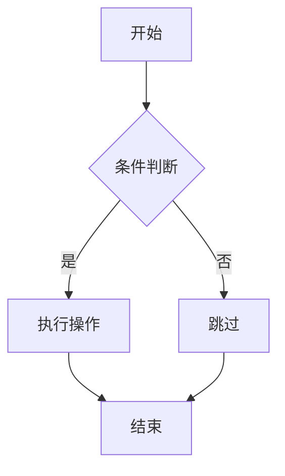
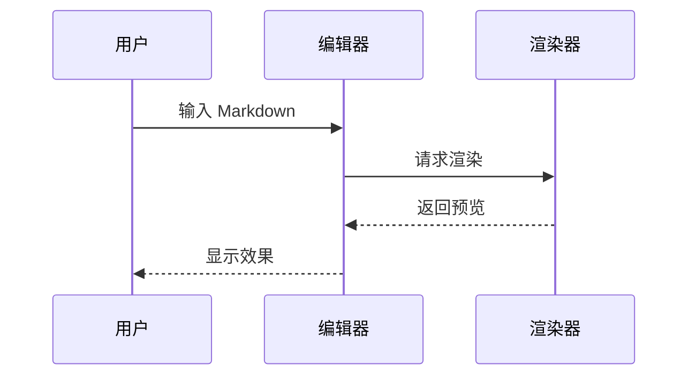
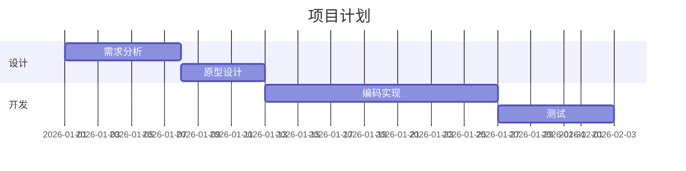
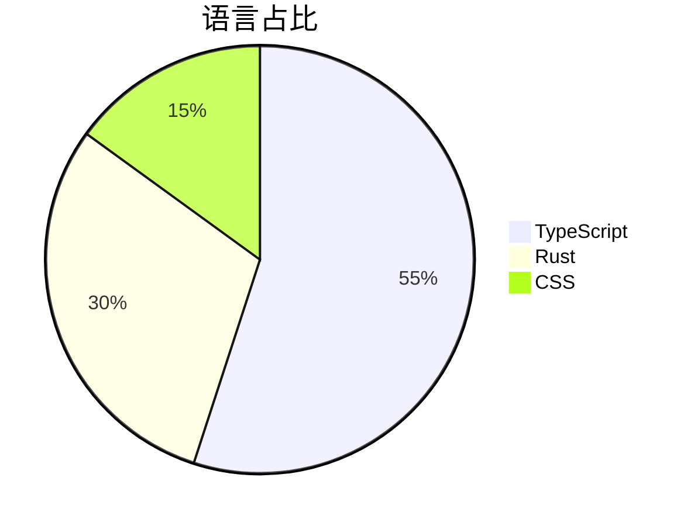
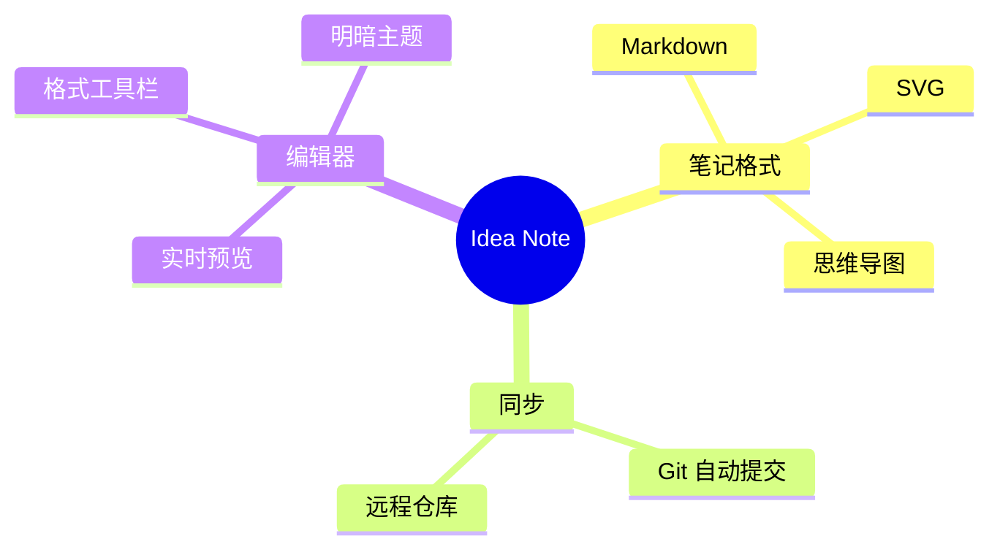
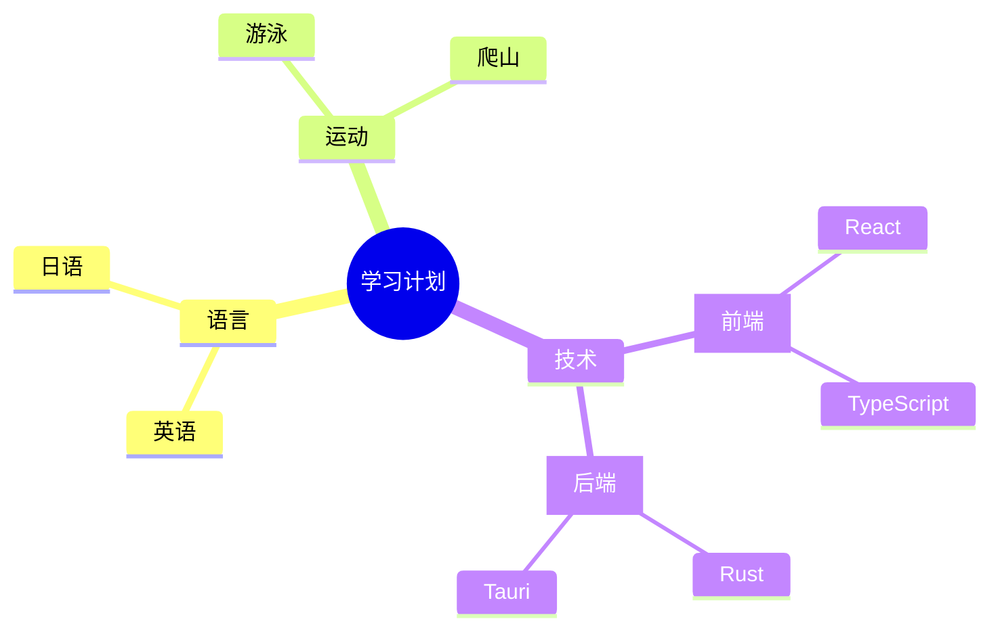

# Markdown 语法大全测试文档

这份文档用于测试编辑器对 CommonMark、常见 Markdown 写法与 GFM（GitHub Flavored Markdown）扩展语法的渲染效果。文档底层仍是纯 Markdown；在 Idea Note 中，光标所在行显示源码，其余行尽量渲染为预览效果。标注为“兼容性测试”的内容用于暴露差异，不等于当前 live preview 已经完整渲染。

---

## 一、标题

# 一级标题 H1
## 二级标题 H2
### 三级标题 H3
#### 四级标题 H4
##### 五级标题 H5
###### 六级标题 H6

### Setext 风格标题

Setext 一级标题
==============

Setext 二级标题
--------------

### 标题边界

####### 七个井号不是标准标题

#标题后没有空格时通常不是标题

---

## 二、段落与换行

这是第一个段落。段落之间用一个空行分隔。

这是第二个段落，里面包含一些较长的文字，用来测试自动换行的效果。当一行文字超过编辑器宽度时，应当自动折行而不是被截断。

行尾加两个空格可以产生硬换行：  
第一行（上一行末尾有两个空格）  
第二行。

行尾加反斜杠也可以产生硬换行：\
这一行应当紧接上一行之后显示。

普通换行在多数 Markdown 渲染器中会作为同一段落处理。
这行和上一行之间没有空行。

---

## 三、强调（行内格式）

- **加粗文本**（双星号）
- __加粗文本__（双下划线）
- *斜体文本*（单星号）
- _斜体文本_（单下划线）
- ***粗斜体***（三星号）
- ___粗斜体___（三下划线）
- ~~删除线~~（GFM）
- `行内代码`
- 普通文字与 `inline code` 混排
- 组合：**加粗里有 `代码` 和 *斜体***
- 组合：*斜体里有 **加粗** 和 ~~删除线~~*
- 标点边界：这是一段**紧贴中文**的加粗，word*inside*word 用来观察英文单词内部强调。
- 行内代码里的标记不应生效：`**not bold** _not italic_ [not link](#)`
- 含反引号的行内代码：``Use `code` inside inline code``

---

## 四、引用

> 这是一段引用文字。
> 引用可以有多行，构成一整块。

> 引用里也可以包含**加粗**、*斜体*、`代码` 等行内格式。

嵌套引用：

> 第一层引用
>
> > 第二层引用（嵌套）
> >
> > > 第三层引用

引用里包含列表和代码：

> - 引用中的无序列表
> - 第二项
>
> ```ts
> const quoted = true;
> ```

---

## 五、列表

### 无序列表（含多级嵌套）

- 一级项目 A
- 一级项目 B
  - 二级项目 B-1
  - 二级项目 B-2
    - 三级项目 B-2-a
    - 三级项目 B-2-b
- 一级项目 C

### 不同无序列表标记

* 星号项目
+ 加号项目
- 减号项目

### 有序列表

1. 第一步
2. 第二步
3. 第三步
   1. 第三步的子项 1
   2. 第三步的子项 2
4. 第四步

### 起始编号与多位编号

7. 从 7 开始
8. 自动继续
10. 源码写 10，渲染器可能按源码显示，也可能自动编号

### 有序与无序混合嵌套

1. 准备工作
   - 检查环境
   - 安装依赖
2. 执行
   - 运行脚本
     1. 子步骤一
     2. 子步骤二

### 列表项里的段落与代码

- 第一段。

  同一个列表项里的第二段，需要缩进。

- 含代码块的列表项：

  ```bash
  npm run build
  ```

### 任务列表（GFM）

- [ ] 已完成的任务
- [X] 大写 X 也表示完成
- [ ] 未完成的任务
- [ ] 另一个待办
  - [x] 子任务已完成
  - [ ] 子任务待完成

---

## 六、代码

### 行内代码

使用 `npm install` 安装依赖，配置文件是 `package.json`。

### 围栏代码块（带语言高亮）

```javascript
// JavaScript 示例
function greet(name) {
  const msg = `Hello, ${name}!`;
  console.log(msg);
  return msg;
}

greet("Idea Note");
```

```python
# Python 示例
def fib(n):
    a, b = 0, 1
    for _ in range(n):
        a, b = b, a + b
    return a

print([fib(i) for i in range(10)])
```

```java
// Java 示例
public class Main {
    public static void main(String[] args) {
        System.out.println("Hello, Markdown!");
    }
}
```

```markdown
# 代码块里的 Markdown 不应被渲染

- **bold?**
- [link](https://example.com)
```

```
没有指定语言的纯文本代码块
Level 3:    A --------> D
Level 2:    A --> B --> D
Level 1:    A --> B --> C --> D
```

### 波浪线围栏

~~~json
{
  "name": "Idea Note",
  "markdown": true
}
~~~

### 缩进代码块

    四个空格缩进也可以形成代码块
    const indented = true;

---

## 七、链接与图片

### 链接

- [行内链接](https://example.com)
- [带标题的链接](https://example.com "鼠标悬停标题")
- [相对链接](./markdown-语法大全.md)
- [锚点链接](#八表格gfm)
- 自动链接：<https://example.com>
- 自动邮箱：<hello@example.com>
- 裸 URL（GFM autolink literal）：https://example.com/path?q=idea-note
- 裸邮箱（GFM autolink literal）：hello@example.com
- [引用式链接][ref]
- [可复用引用式链接][shared-ref]
- [引用式链接可以省略标签][]

[ref]: https://example.com "引用式链接定义"
[shared-ref]: https://github.github.com/gfm/
[引用式链接可以省略标签]: https://commonmark.org/

### 图片

本地照片：


本地gif动图：


网络图片：


网络图片（带标题）：


引用式图片：

![引用式图片][sample-image]

[sample-image]: ./assets/markdown-sample.svg "引用式本地图片"

引用式图片用于兼容性测试；当前 live preview 重点覆盖行内图片 URL 与相对路径解析。

---

## 八、表格（GFM）

### 基础表格

| 语言 | 主要用途 | 特点 |
|------|------|------|
| Python | 数据分析与脚本 | 语法简洁，生态丰富 |
| Rust | 系统与高性能服务 | 内存安全，无垃圾回收 |
| TypeScript | 前端与全栈开发 | 为 JavaScript 增加静态类型 |
| Go | 云原生与后端服务 | 并发模型简单，编译快 |

### 列对齐

| 左对齐 | 居中对齐 | 右对齐 |
|:-------|:--------:|-------:|
| left | center | right |
| 文本 | 文本 | 文本 |
| a | bb | ccc |

### 表格里的行内格式

| 类型 | 示例 | 备注 |
|------|------|------|
| 加粗 | **bold** | 常见行内语法 |
| 代码 | `const x = 1` | 代码内容 |
| 链接 | [example](https://example.com) | 单元格链接 |
| 转义竖线 | a \| b | 单元格里显示竖线 |

表格内行内格式与转义竖线用于边界测试；当前表格预览重点覆盖表格结构、列对齐和基础单元格文本。

---

## 九、分割线

下面是三种常见写法：

---

***

___

带空格的写法：

- - -

* * *

_ _ _

---

## 十、转义字符

使用反斜杠转义特殊字符：

- \*不会变成斜体\*
- \_不会变成斜体\_
- \# 不会变成标题
- \`不会变成代码\`
- \[不会变成链接\](https://example.com)
- \!不会变成图片
- \> 不会变成引用
- \- 不会变成列表
- \+ 不会变成列表
- \1. 不会变成有序列表
- 反斜杠本身：\\

---

## 十一、HTML 与实体

Markdown 允许混入 HTML。本编辑器会渲染常见 HTML，并通过 DOMPurify 自动消毒：`<script>`、`onclick` 等事件属性、`javascript:` 链接都会被剥离，不会执行。

### 行内 HTML

这一行混用了 <b>加粗</b>、<i>斜体</i>、<u>下划线</u>、<s>删除线</s>、<mark>高亮</mark> 和 <code>行内代码</code>，还能与 **Markdown 加粗**、[链接](https://example.com) 混排。

快捷键徽标：<kbd>Cmd</kbd> + <kbd>Shift</kbd> + <kbd>S</kbd>

颜色与字号：<font color="#e03131">红色(font)</font>、<span style="color:#2f9e44">绿色(span style)</span>、<span style="background:#ffec99">黄色底纹</span>、<small>小号字</small>。

上下标：水分子 H<sub>2</sub>O，质能方程 E = mc<sup>2</sup>，第 1<sup>st</sup> 名。

强制换行：第一行<br>第二行（由 `<br>` 产生）。

### 块级 HTML

<div style="padding:12px;background:#eef2ff;border:1px solid #c7d2fe;border-radius:8px">
  这是一个带内联样式的 <b>div 盒子</b>，里面可以放 <font color="#1971c2">彩色文字</font>、<code>代码</code> 等内容。
</div>

<div align="center">这一段通过 <code>align="center"</code> 居中显示。</div>

<details>
<summary>点击展开 / 收起（details + summary）</summary>
折叠区内部可以写多行内容（注意：折叠块内部不要留空行，否则会被截断为多个 HTML 块）。
支持 <b>加粗</b>、<code>代码</code>、<font color="#1971c2">彩色</font> 等行内 HTML。
</details>

原生 HTML 表格（不使用 Markdown 表格语法）：

<table>
  <thead>
    <tr><th>列 A</th><th>列 B</th></tr>
  </thead>
  <tbody>
    <tr><td><b>加粗单元格</b></td><td><font color="#2f9e44">绿色</font></td></tr>
    <tr><td>普通文本</td><td><a href="https://example.com">站点链接</a></td></tr>
  </tbody>
</table>

### HTML 图片 ``

除了 Markdown 的 ``，也可以直接用 `` 标签，好处是能控制宽高、对齐等。本地相对路径、绝对路径与网络地址都会自动解析（本地路径走资产协议加载）。

本地相对路径（指定宽度）：


网络图片：


居中显示并控制尺寸：

<div align="center"></div>

### Markdown 表格里嵌 HTML

| 名称   | 渲染效果                                   |
| ------ | ------------------------------------------ |
| 加粗   | <b>HTML 加粗</b> 与 ***Markdown 粗斜***    |
| 颜色   | <font color="#e8590c">橙色</font> + `code` |
| 上下标 | x<sup>2</sup> 与 H<sub>2</sub>O            |
| 换行   | 第一行<br>第二行                           |
| 链接   | <a href="https://example.com">站点</a>     |

### 内嵌 SVG

SVG 本质就是 HTML 元素，所以可以**不引用外部文件**，直接把图形写进正文里即时渲染。

最简单的 SVG —— 一个圆和一个圆角矩形：

<svg width="220" height="90" xmlns="http://www.w3.org/2000/svg">
  <circle cx="45" cy="45" r="32" fill="#E24B4A"/>
  <rect x="100" y="20" width="100" height="50" rx="12" fill="#378ADD"/>
</svg>

行内还能画图标（矢量、可无限缩放），比如一个对勾徽章：

<svg width="64" height="64" viewBox="0 0 64 64" xmlns="http://www.w3.org/2000/svg">
  <circle cx="32" cy="32" r="28" fill="#1D9E75"/>
  <path d="M20 33 L29 42 L45 24" fill="none" stroke="#ffffff" stroke-width="5" stroke-linecap="round" stroke-linejoin="round"/>
</svg>

不依赖任何图表库，纯 SVG 也能画数据图：

<svg width="320" height="160" viewBox="0 0 320 160" xmlns="http://www.w3.org/2000/svg">
  <line x1="40" y1="130" x2="300" y2="130" stroke="#B4B2A9" stroke-width="1"/>
  <rect x="60"  y="70"  width="36" height="60"  rx="4" fill="#7F77DD"/>
  <rect x="120" y="40"  width="36" height="90"  rx="4" fill="#7F77DD"/>
  <rect x="180" y="90"  width="36" height="40"  rx="4" fill="#7F77DD"/>
  <rect x="240" y="55"  width="36" height="75"  rx="4" fill="#7F77DD"/>
  <text x="78"  y="148" font-size="12" text-anchor="middle" fill="#5F5E5A">一月</text>
  <text x="138" y="148" font-size="12" text-anchor="middle" fill="#5F5E5A">二月</text>
  <text x="198" y="148" font-size="12" text-anchor="middle" fill="#5F5E5A">三月</text>
  <text x="258" y="148" font-size="12" text-anchor="middle" fill="#5F5E5A">四月</text>
</svg>

用线条和文字组合，画一条"打开文件 → 判断格式 → 渲染"的流程：

<svg width="440" height="80" viewBox="0 0 440 80" xmlns="http://www.w3.org/2000/svg">
  <rect x="10"  y="25" width="110" height="36" rx="8" fill="#E6F1FB" stroke="#185FA5"/>
  <text x="65"  y="48" font-size="13" text-anchor="middle" fill="#0C447C">打开文件</text>
  <line x1="120" y1="43" x2="160" y2="43" stroke="#888780" stroke-width="1.5"/>
  <polygon points="160,43 152,39 152,47" fill="#888780"/>
  <rect x="165" y="25" width="110" height="36" rx="8" fill="#FAEEDA" stroke="#BA7517"/>
  <text x="220" y="48" font-size="13" text-anchor="middle" fill="#633806">判断格式</text>
  <line x1="275" y1="43" x2="315" y2="43" stroke="#888780" stroke-width="1.5"/>
  <polygon points="315,43 307,39 307,47" fill="#888780"/>
  <rect x="320" y="25" width="110" height="36" rx="8" fill="#E1F5EE" stroke="#0F6E56"/>
  <text x="375" y="48" font-size="13" text-anchor="middle" fill="#085041">渲染预览</text>
</svg>

SVG 也可以混在一行文字里，像这样 <svg width="16" height="16" viewBox="0 0 16 16" xmlns="http://www.w3.org/2000/svg"><circle cx="8" cy="8" r="7" fill="#F4BF4F"/></svg> 当作一个小标记使用。

> 提示：如果预览里看不到上面的图形，说明编辑器的 HTML 净化（DOMPurify）默认没有放行 SVG 标签——这正是需要在 `sanitizeHtml` 里开启 `svg` 配置的地方。

### 安全消毒（这些危险写法不会执行）

下面的写法在渲染时会被自动清理 —— 脚本整段移除、事件属性被删、`javascript:` 链接失效：

```html
<script>alert('xss')</script>

<a href="javascript:alert('xss')">看似正常的链接</a>
```

> 即使把上面的内容直接写进正文，`<script>` 也会被移除，`` 仅保留安全属性（事件处理器被删），`<a>` 的危险 `href` 会被清空。

### HTML 实体与注释

HTML 实体：&copy; &reg; &trade; &amp; &lt; &gt; &mdash; &hearts; &#169; &#x2665;

HTML 注释不会显示（下一行渲染后不可见）：

<!-- 这是一段 HTML 注释，渲染后应当不可见 -->

---

## 十二、GFM 扩展与常见变体

### 删除线

~~这段文字被删除。~~

### 自动链接字面量

访问 https://github.com 或联系 hi@example.com。

### 任务列表交互

- [ ] 点击预览态复选框应能切换源码
- [x] 已勾选项再次点击应取消

### 脚注写法

脚注不是 GFM 标准的一部分，很多 Markdown 渲染器支持，但当前 Idea Note 未专门实现脚注预览。这里保留为兼容性测试。[^note]

[^note]: 这是一条脚注定义。

### 定义列表写法

定义列表也不是 CommonMark/GFM 标准语法，部分渲染器支持。这里保留为兼容性测试。

术语
: 定义内容

---

## 十三、数学公式

数学公式不是 CommonMark/GFM 标准语法，Typora、Obsidian 等通过 KaTeX/MathJax 支持。Idea Note 现已通过 KaTeX 渲染行内 $...$ 与块级 $$...$$ 公式；把光标移入公式所在行/块即可显示并编辑源码。

### 行内公式

质能方程 $E = mc^2$ 与勾股定理 $a^2 + b^2 = c^2$ 可以嵌在文字中间，如 $\sqrt{2} \approx 1.414$。

### 块级公式

$$
\int_{-\infty}^{\infty} e^{-x^2}\,dx = \sqrt{\pi}
$$

### 分式、上下标与求和

$$
f(x) = \frac{1}{2\pi} \sum_{n=1}^{\infty} \frac{x^n}{n!}
$$

### 希腊字母与运算符

行内：$\alpha + \beta = \gamma$，$\nabla \cdot \mathbf{E} = \dfrac{\rho}{\varepsilon_0}$。

### 矩阵

$$
A = \begin{pmatrix} a & b \\ c & d \end{pmatrix}
$$

### 多行对齐方程

$$
\begin{aligned}
(x + y)^2 &= x^2 + 2xy + y^2 \\
(x - y)^2 &= x^2 - 2xy + y^2
\end{aligned}
$$

### 公式中的特殊字符

行内代码里的 `$` 不应触发公式，例如 `price = $5`。转义的 \$3 也应保持为普通美元符号。

---

## 十四、图表（Mermaid）

Idea Note 支持 ` ```mermaid ` 代码块，使用 Mermaid 渲染流程图、时序图等。把光标移入代码块即可编辑源码，移出后显示图表。

### 流程图



### 时序图



### 甘特图



### 饼图



### 思维导图

思维导图**不需要任何新格式**——同样写在 ` ```mermaid ` 代码块里，用缩进表示层级，`root(( ))` 是中心主题：



不同括号代表不同节点形状：`(( ))` 圆形、`( )` 圆角、`[ ]` 方形、`{{ }}` 六边形。



### 错误处理

下面的图表语法有误，应显示友好的错误提示而不是让整个应用崩溃：

```mermaid
flowchart TD
    A -->
    非法图表语法 ][
```

---


## 十五、综合混排

> **提示：** 下面的列表里混合了 `代码`、[链接](https://example.com) 和 ~~删除线~~。
>
> 1. 第一项包含 **加粗** 文本
> 2. 第二项包含一段代码：`const x = 1;`
> 3. 第三项包含一个表格的引用说明

| 功能 | 是否支持 | 备注 |
|------|:--------:|------|
| ATX 标题 | 是 | H1-H6 |
| Setext 标题 | 兼容性测试 | 常见变体 |
| 列表嵌套 | 是 | 多级 |
| 代码块 | 是 | 围栏、缩进、行号 |
| 表格 | 是 | GFM，对齐与基础单元格 |
| 任务列表 | 是 | GFM，复选框可切换 |
| 图片 | 是/兼容性测试 | 网络、相对路径、本地 GIF；`` 标签同样支持本地路径；引用式为兼容性测试 |
| HTML | 兼容性测试 | 渲染策略依实现而定；`` 本地路径自动走资产协议 |
| 内嵌 SVG | 是 | 正文中的 `<svg>` 直接渲染，支持行内混排 |
| 脚注/定义列表 | 兼容性测试 | 非 CommonMark/GFM 核心 |
| 数学公式 | 是 | KaTeX 渲染行内 $...$ 与块级 $$...$$ |
| 图表 | 是 | Mermaid 流程图、时序图、甘特图、饼图、思维导图等 |

---

文档结束。如果基础语法、GFM 语法和兼容性测试都能按预期显示，说明编辑器的 Markdown 支持覆盖面已经比较完整。
