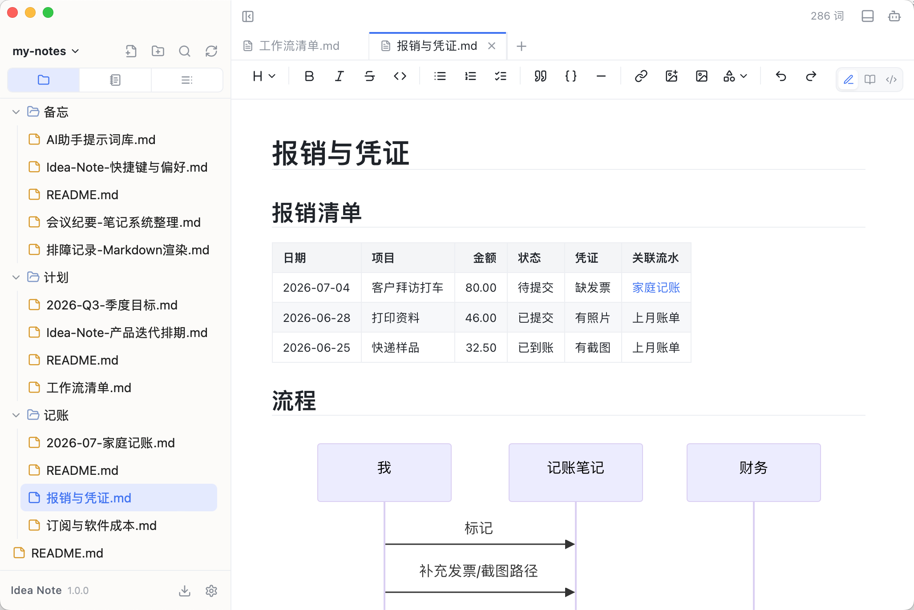
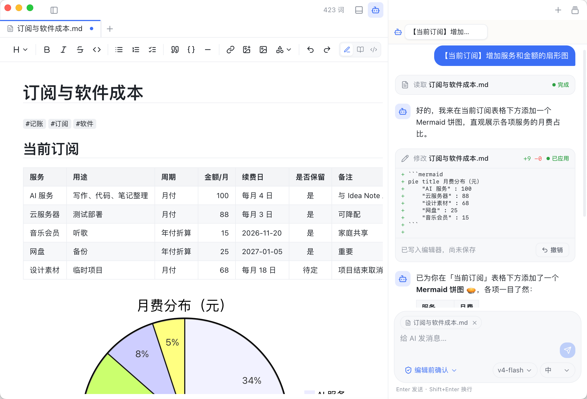
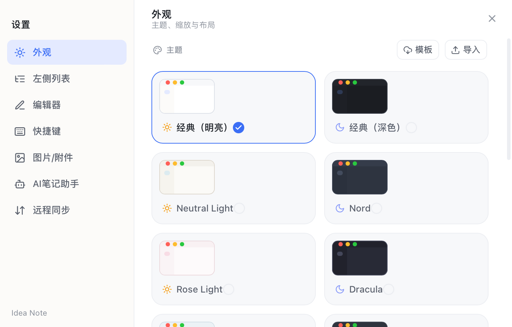

# 一款支持AI笔记助手和远程同步的markdown笔记idea-note 

新写了一款所见即所得的轻量级markdown笔记Idea Note ，内置 AI 笔记助手，可理解、检索并编辑你的笔记，支持Git远程同步。

主界面：





AI笔记助手：



## 功能特性

- **AI 笔记助手**：可结合当前笔记进行问答、总结、润色，并通过工具直接读取、搜索、新建、编辑或删除笔记。
- **Markdown 编辑**：所见即所得实时预览，支持 CommonMark + GFM、KaTeX 公式、Mermaid 图表、HTML / SVG 渲染、源码模式、多标签页和格式工具栏。
- **笔记管理**：提供笔记模式、大纲和全局搜索，方便整理、定位和回看内容。
- **文件管理**：可作为轻量级项目文件管理器，支持文件树、文件夹浏览、普通文本编辑和图片查看。
- **Git 同步与历史**：支持自动提交、远程推拉、本地版本记录、单文件 / 全局历史和 diff 对比。
- **内置终端**：集成终端，可在应用内直接执行命令。
- **导出与系统集成**：可导出带书签大纲的 PDF，支持系统级“打开方式”关联常见文本、代码与图片文件。
- **其他特性**：支持切换主题和自定义主题、字体设置。

## 使用说明

### 安装

可在 [idea-note/releases](https://github.com/Liubsyy/idea-note/releases) 页面下载对应的桌面安装包或发行文件。

MacOS 首次安装时如果遇到"无法打开"或"应用已损坏"之类的权限提示，可按下面方式处理：

1. "系统设置 -> 隐私与安全性"中找到被拦截的应用，点击"仍要打开"
2. 如果第1种方式不行，可以在终端执行以下命令后重新打开
```
xattr -rd com.apple.quarantine /Applications/Idea\ Note.app
```

### 笔记管理

首次启动时选择一个本地文件夹作为工作区，所有笔记都以普通文件形式存放在这个文件夹里，不使用私有格式，随时可以用其他工具打开。

左侧列表提供三种视图，可在顶部切换：

- **文件模式**：完整文件树，可新建、重命名、拖拽整理文件与文件夹，也能编辑普通文本、查看图片，当作轻量的项目文件管理器使用
- **笔记模式**：只显示 Markdown 笔记，支持卡片和树形两种展示方式，专注于笔记本身
- **预览大纲**：当前笔记的标题大纲，点击标题即可跳转

侧栏还提供全局搜索（`Cmd/Ctrl+Shift+F`），可在整个工作区内按关键词定位内容。安装后 Idea Note 也会注册为常见文本、Markdown、代码与图片文件的系统"打开方式"，可以直接从文件管理器中用它打开单个文件。

### 编辑笔记

正文采用所见即所得的实时预览：光标点进公式、表格、Mermaid 图表等块时显示源码方便编辑，移开光标即渲染成型。每个标签页右上角可在三种模式间切换：

- **编辑**：实时预览编辑（默认）
- **只读**：纯阅读，防止误改
- **源码**：完整 Markdown 源码，适合大段整理

顶部工具栏可一键插入标题、加粗 / 斜体 / 删除线、列表与任务列表、引用、代码块、链接、图片、表格、KaTeX 数学公式，以及流程图、时序图、甘特图等各类 Mermaid 图表。支持多标签页同时打开多篇笔记；粘贴的图片和文件会自动保存为附件，保存目录可在设置中配置。

Markdown 语法的完整支持范围可参考 [doc/markdown-语法大全.md](./doc/markdown-语法大全.md)。

### AI 笔记助手

点击标题栏机器人图标打开 AI 笔记助手面板。在设置中添加模型服务即可使用：支持 Anthropic、OpenAI 以及任何兼容两者接口的服务（自定义 Base URL、API Key 和模型 ID），对话中可随时切换模型与思考级别。

助手能看到当前打开的笔记，可以直接问答、总结、润色；它还内置一组笔记工具，可以搜索工作区、读取任意笔记，并新建、编辑、删除笔记。所有修改操作默认"编辑前确认"，逐条审阅后再生效，也可切换为自动执行。会话支持多开并保留历史，随时回看或删除。

实现原理见 [doc/AI笔记助手原理.md](./doc/AI笔记助手原理.md)。

### Git 同步与历史记录

在"设置 → 远程同步"中配置，基于命令行 git 实现（需已安装 git），支持两种方式：

- **仅本地**：将工作区初始化为本地 git 仓库，修改自动提交为版本快照，不推送到任何远程，之后可随时升级为远程同步
- **远程同步**：关联 GitHub / Gitee / 自建等任意远程仓库，或直接克隆一个远程仓库作为新笔记库；开启自动同步后按设定间隔（1–60 分钟）在后台自动执行"提交 → 拉取合并 → 推送"，也可随时手动同步

两端修改了同一处时，双方内容都会以 `<<<<<<<` 标记保留在文件中，整理后再次同步即可，不会丢失内容。网络受限时可配置仅同步时生效的 HTTP 代理，不写入 git 全局配置。

点击标题栏历史图标，可查看当前笔记的每一次变更并左右对比差异，也可切换到全局历史浏览整个工作区的提交记录。

### 内置终端

点击标题栏终端图标可打开底部终端面板，直接在工作区目录下执行命令，运行脚本、使用 git 等都无需离开应用。

### 导出 PDF

在侧栏文件右键菜单中选择"导出 PDF"，通过系统 WebView 静默打印直接生成 PDF 文件，自动附带书签大纲，公式、图表、代码高亮与应用内显示一致，无需安装任何额外组件。

### 设置

在侧栏底部齿轮图标打开设置窗口，包含以下配置项：

- **外观**：明暗主题与主题色、界面缩放、紧凑排版，支持导入自定义主题 JSON
- **左侧列表**：各视图的字体大小
- **编辑器**：字体、字号、行高与标题缩放
- **快捷键**：自定义编辑器快捷键
- **图片/附件**：粘贴图片与文件的保存目录（笔记目录 / 工程目录 / 绝对目录）
- **AI 笔记助手**：模型服务、API Key 与字号
- **远程同步**：Git 仓库与同步代理




