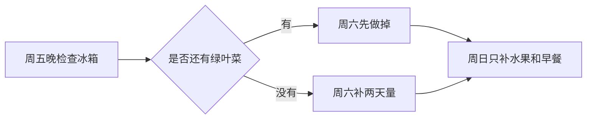

# 周末采购备忘

`#备忘` `#采购` `#日常`

## 常买清单

| 分类 | 常买 | 偏好 | 不买 |
| --- | --- | --- | --- |
| 蔬菜 | 西兰花、番茄、菠菜 | 叶菜当天吃完 | 处理麻烦的整颗南瓜 |
| 水果 | 香蕉、蓝莓、橙子 | 香蕉买偏青的 | 已切盒装水果 |
| 早餐 | 鸡蛋、牛奶、全麦吐司 | 牛奶 950ml 装刚好 | 甜味麦片 |
| 日用品 | 抽纸、洗衣凝珠、垃圾袋 | 垃圾袋 45cm | 太香的清洁剂 |

## 冰箱消耗节奏

## 本周记一下

- [ ] 酱油快见底，买小瓶装就够
- [ ] 厨房纸还有 2 卷，不急
- [ ] 洗手液替换装可以等活动价
- [ ] 猫砂盆除味珠看评价再买

## 价格参考

| 物品 | 合理价格 | 备注 |
| --- | ---: | --- |
| 鸡蛋 30 枚 | 28-36 元 | 低于 28 元看日期 |
| 蓝莓 125g | 12-18 元 | 软盒要轻压检查 |
| 抽纸 18 包 | 45-60 元 | 低于 45 元可以囤 |
| 洗衣凝珠 40 颗 | 35-48 元 | 别买浓香型 |

> 采购前先看一眼厨房台面，很多“缺了”的东西其实在第二排。
