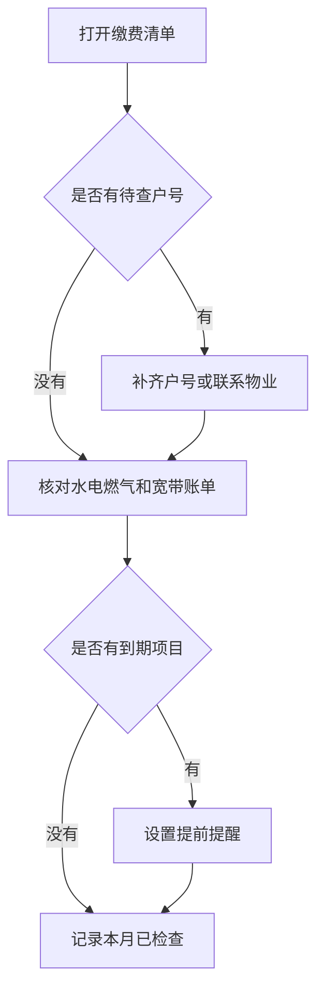

# 生活缴费与证件到期

`#备忘` `#缴费` `#证件` `#待查`

## 缴费账户

| 类型 | 平台 | 户号/关键词 | 检查频率 |
| --- | --- | --- | --- |
| 水费 | 城市生活 App | 星河花园 8-1203 | 每月 5 日 |
| 电费 | 微信生活缴费 | 家庭电表 | 每月 10 日 |
| 燃气 | 燃气公司小程序 | 待补户号 | 每月 10 日 |
| 宽带 | 运营商 App | 家庭宽带 | 每月 20 日 |

## 证件与服务到期

| 项目 | 到期日 | 提前提醒 | 备注 |
| --- | --- | --- | --- |
| 身份证 | 2031-04-18 | 提前 3 个月 | 工作日去派出所 |
| 护照 | 2029-09-30 | 提前 6 个月 | 出境计划前先查有效期 |
| 驾驶证 | 2030-06-12 | 提前 90 天 | 体检点可线上查 |
| 小区停车月卡 | 每月 28 日 | 提前 3 天 | 物业前台续费 |

## 月初检查流程

## 待补

- [ ] 燃气户号
- [ ] 宽带套餐到期日期
- [ ] 物业停车月卡是否能线上续费

> 证件类提醒不要只放在日历里，这里也留一份，搜索“到期”时能一起看到。
