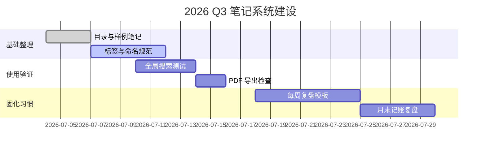

# 2026 Q3 季度目标

> 主题：让笔记系统真正服务日常决策，而不是只保存漂亮文本。

## 北极星指标

- 每周至少沉淀 **5 条可复用笔记**。
- 重要计划都能在 30 秒内通过全局搜索找到。
- 个人现金流误差控制在 $\pm 3\%$ 内。

$$
\text{执行率} = \frac{\text{已完成关键任务数}}{\text{计划关键任务数}} \times 100\%
$$

## OKR

| 目标 | 关键结果 | 当前状态 | 风险 |
| --- | --- | --- | --- |
| O1：稳定个人知识库 | KR1：建立计划/备忘/记账三目录 | 进行中 | 命名不一致 |
| O1：稳定个人知识库 | KR2：每周一次整理归档 | 未开始 | 容易拖延 |
| O2：验证 Idea Note 工作流 | KR1：测试 Mermaid/KaTeX/HTML/PDF 导出 | 进行中 | 部分语法边界复杂 |
| O3：改善财务感知 | KR1：月末完成分类汇总 | 未开始 | 小额支出漏记 |

## 每周节奏

1. 周一：写本周目标，拆成不超过 7 个任务。
2. 周三：检查阻塞项，只调整动作，不重写目标。
3. 周五：做 20 分钟复盘，把完成证据链接到相关笔记。
4. 周日：清理收件箱，把临时想法归入计划或备忘。

## 任务板

- [x] 创建 `my-notes` 工作区结构
- [x] 补齐计划、备忘、记账三个目录
- [ ] 用 Idea Note 打开后检查笔记模式摘要是否自然
- [ ] 搜索 `#待处理` 并处理高优先级项
- [ ] 导出一份 PDF，看目录书签是否完整

## 时间线

## 关联

- [产品迭代排期](./Idea-Note-产品迭代排期.md)
- [工作流清单](./工作流清单.md)
- [家庭记账](../记账/2026-07-家庭记账.md)

---

备注： 如果计划写得太满，优先保留“能产生复盘材料”的任务。
