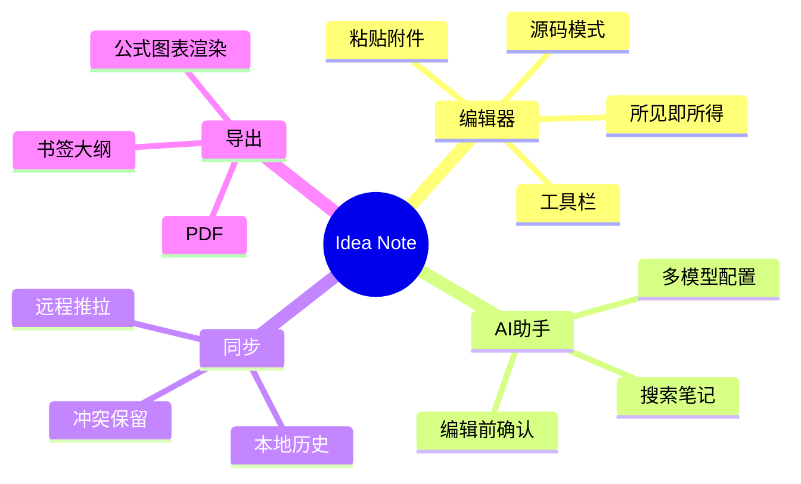
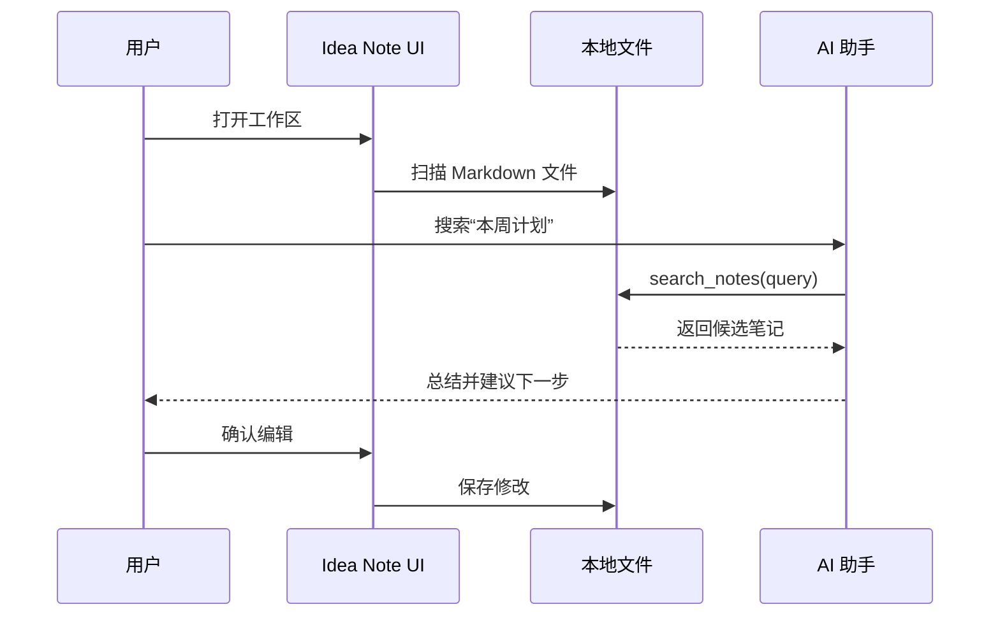

# Idea Note 产品迭代排期

`#idea-note` `#产品` `#排期`

## 背景

这份笔记模拟一次桌面 Markdown 应用的迭代计划，重点覆盖 **编辑器、AI 助手、Git 同步、导出 PDF** 四条线。

> 判断一个功能是否值得做：它能否减少用户在“记录、查找、整理、同步”之间切换的摩擦。

## 模块拆分



## 迭代候选

| 优先级 | 功能 | 用户价值 | 验收方式 |
|:---:| --- | --- | --- |
| P0 | 大纲点击定位更稳定 | 长文导航不迷路 | 打开 2000 行文档，标题跳转准确 |
| P0 | 表格预览边界修复 | 记账和排期更可读 | 含 `\|` 的单元格不破版 |
| P1 | AI 助手批量整理标签 | 降低归档成本 | 对 10 篇笔记建议标签 |
| P1 | 历史 diff 更清晰 | 修改可追溯 | 单文件历史能看懂差异 |
| P2 | 主题导入校验 | 避免配置错误 | 无效主题给出提示 |

## 发布检查清单

- [ ] `npm run build` 通过
- [ ] `cargo test --manifest-path src-tauri/Cargo.toml` 通过
- [ ] 手动测试打开 `.md`、`.txt`、`.png`
- [ ] 检查中文路径：`/Users/liubs/VibeCoding/my-notes/计划`
- [ ] Git 同步冲突提示符合预期
- [ ] 导出 PDF 后公式、图表、代码块不丢失

## 流程



## 风险记录

| 风险 | 迹象 | 预案 |
| --- | --- | --- |
| 复杂 Markdown 渲染卡顿 | 大文档滚动掉帧 | 增量渲染、延迟解析 |
| Git 冲突理解成本高 | 用户看到 `<<<<<<<` 不知道怎么办 | 给冲突解释和清理入口 |
| AI 编辑过度自信 | 一次改太多文件 | 保留逐条确认和历史回滚 |

## 代码片段备忘

```ts
const noteKinds = ["计划", "备忘", "记账"] as const;
type NoteKind = typeof noteKinds[number];

function notePath(kind: NoteKind, name: string) {
  return `${kind}/${name}.md`;
}
```

<details>
<summary>暂缓需求</summary>
移动端同步、多人协作、块级引用数据库。它们都很诱人，但当前更需要把单人本地工作流做稳。
</details>
