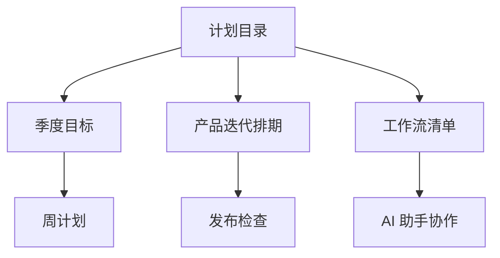

# 计划目录

这里放短期计划、项目排期、复盘模板和个人节奏表。

## 本周关注

- [ ] 完成 `Idea Note` 的一次真实笔记库压力测试
- [ ] 把常用工作流整理成 [工作流清单](./工作流清单.md)
- [x] 建立 Q3 目标草稿
- [ ] 给记账目录补一份报销检查清单

## 目录地图

## 标签

`#计划` `#idea-note` `#项目管理` `#待处理`
