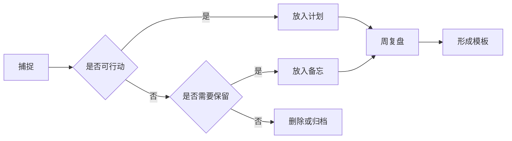

# 工作流清单

## 日常捕捉

- [ ] 临时想法先写到当天笔记或相关主题下
- [ ] 超过 3 行的想法补一个 `## 背景`
- [ ] 需要行动的内容必须有任务框
- [ ] 需要查找的内容至少有一个稳定关键词

## 笔记加工流水线

## 命名约定

| 类型 | 推荐命名 | 示例 |
| --- | --- | --- |
| 日期计划 | `YYYY-MM-DD-主题.md` | `2026-07-周计划.md` |
| 长期目标 | `YYYY-Qn-主题.md` | `2026-Q3-季度目标.md` |
| 备忘 | `对象-主题.md` | `周末采购备忘.md` |
| 记账 | `YYYY-MM-范围.md` | `2026-07-家庭记账.md` |

## 复盘问题

> 每周只回答三个问题，避免复盘变成写作文。

1. 哪件事本周推进得最顺？为什么？
2. 哪个计划被反复拖延？阻力是什么？
3. 下周如果只做一件事，应该是哪件？

## Idea Note 功能测试点

- [ ] 笔记模式只显示 Markdown 文件
- [ ] 大纲能识别 `#` 到 `######`
- [ ] 表格单元格里的 **加粗**、`代码`、<kbd>Cmd</kbd> 标记显示自然
- [ ] Mermaid 图表在预览态能渲染
- [ ] KaTeX 块级公式能编辑与恢复预览
- [ ] 全局搜索能定位中文与英文混合关键词

---

小提醒：搜索关键词可以故意写自然一点，比如“报销凭证还没补”，比只写“报销”更接近真实使用。
