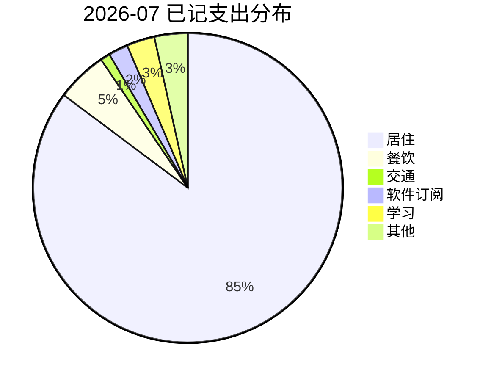

# 2026-07 家庭记账

`#记账` `#预算` `#报销`

## 本月预算

| 类别 | 预算 | 已用 | 剩余 | 备注 |
| --- | ---: | ---: | ---: | --- |
| 餐饮 | 3600 | 486 | 3114 | 工作日午餐偏多 |
| 交通 | 800 | 92 | 708 | 地铁为主 |
| 居住 | 7800 | 7800 | 0 | 房租固定 |
| 软件订阅 | 600 | 188 | 412 | 见 [订阅](./订阅与软件成本.md) |
| 学习 | 1000 | 268 | 732 | 书和课程 |
| 其他 | 1500 | 319 | 1181 | 临时采购 |

$$
\text{预算使用率}=\frac{486+92+7800+188+268+319}{3600+800+7800+600+1000+1500}\approx 61.8\%
$$

## 流水

| 日期 | 商户 | 类别 | 金额 | 支付方式 | 标签 | 备注 |
| --- | --- | --- | ---: | --- | --- | --- |
| 2026-07-01 | 房东 | 居住 | 7800.00 | 银行转账 | `#固定支出` | 7 月房租 |
| 2026-07-01 | 地铁 | 交通 | 12.00 | 交通卡 | `#通勤` | 早晚 |
| 2026-07-02 | 公司楼下简餐 | 餐饮 | 38.00 | 支付宝 | `#午餐` | 偏油 |
| 2026-07-02 | 书店 | 学习 | 128.00 | 微信 | `#书` | Markdown 参考书 |
| 2026-07-03 | 云服务 | 软件订阅 | 88.00 | 信用卡 | `#订阅` | 开发测试环境 |
| 2026-07-03 | 超市 | 其他 | 219.00 | 微信 | `#日用品` | 纸巾、洗衣液 |
| 2026-07-04 | 咖啡 | 餐饮 | 36.00 | 支付宝 | `#待处理` | 和朋友讨论计划 |
| 2026-07-04 | 打车 | 交通 | 80.00 | 支付宝 | `#报销` | 客户拜访，凭证待补 |
| 2026-07-04 | AI 服务 | 软件订阅 | 100.00 | 信用卡 | `#idea-note` | AI 助手测试 |
| 2026-07-04 | 晚餐食材 | 餐饮 | 412.00 | 微信 | `#家庭` | 周末采购 |
| 2026-07-04 | 在线课程 | 学习 | 140.00 | 信用卡 | `#课程` | 知识管理课 |
| 2026-07-04 | 收纳盒 | 其他 | 100.00 | 京东 | `#居家` | 桌面整理 |

## 待处理

- [ ] 上传 2026-07-04 打车发票
- [ ] 确认 AI 服务是否计入软件订阅还是学习支出
- [ ] 周日补记现金支出
- [ ] 月末核对信用卡账单

## 分类复盘

> 餐饮看起来还好，但 7 月第一周有一次大额食材采购，后续要避免外卖叠加。

## 备注

  <b>报销提醒：</b> 所有带 <code>#报销</code> 的支出必须在 7 天内补凭证，否则月末会忘。

