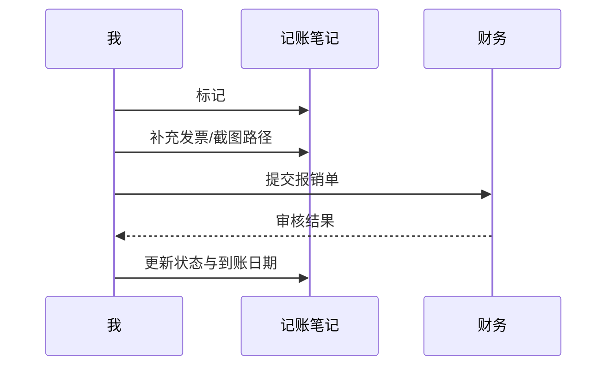

# 报销与凭证


## 报销清单

| 日期 | 项目 | 金额 | 状态 | 凭证 | 关联流水 |
| --- | --- | ---: | --- | --- | --- |
| 2026-07-04 | 客户拜访打车 | 80.00 | 待提交 | 缺发票 | [家庭记账](./2026-07-家庭记账.md) |
| 2026-06-28 | 打印资料 | 46.00 | 已提交 | 有照片 | 上月账单 |
| 2026-06-25 | 快递样品 | 32.50 | 已到账 | 有截图 | 上月账单 |

## 流程



## 检查表

- [ ] 金额与支付记录一致
- [ ] 发票抬头正确
- [ ] 事由写清楚，不只写“交通”
- [ ] 截图包含日期、金额、商户
- [ ] 到账后在当月收入中冲抵

## 凭证命名建议

```text
YYYY-MM-DD_项目_金额_凭证类型.png
2026-07-04_客户拜访打车_80.00_发票.png
```

## 待补说明

> 7 月 4 日客户拜访打车是临时行程，发票还没从平台开。明天上午补。

<span style="color:#d9480f">高优先级：</span> 带 `#待处理` 的报销项不要拖到月末。
