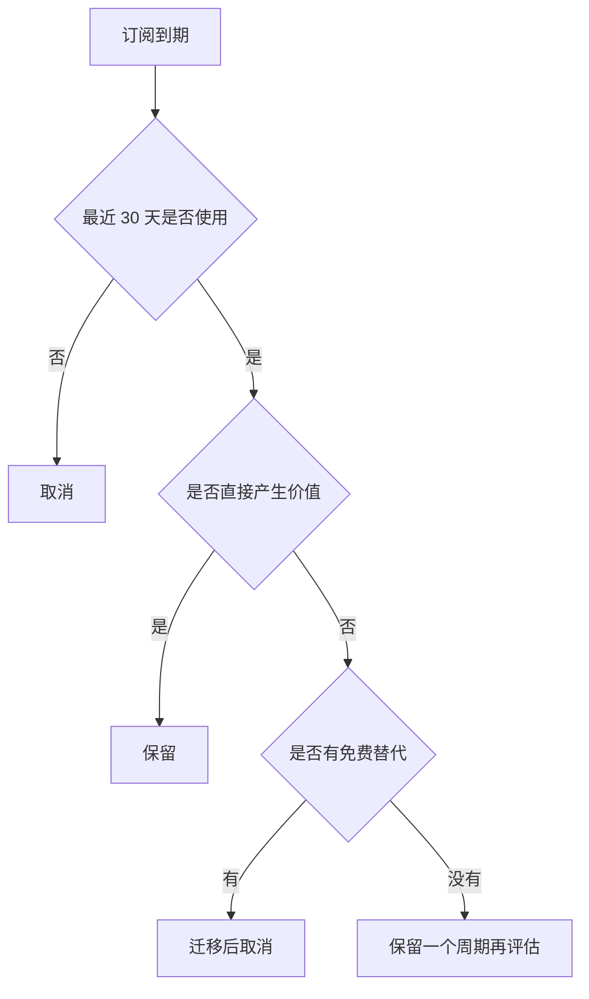

# 订阅与软件成本

`#记账` `#订阅` `#软件`

## 当前订阅

| 服务 | 用途 | 周期 | 金额/月 | 续费日 | 是否保留 | 备注 |
| --- | --- | --- | ---: | --- | :---: | --- |
| AI 服务 | 写作、代码、笔记整理 | 月付 | 100 | 每月 4 日 | 是 | 与 Idea Note 助手配合 |
| 云服务器 | 测试部署 | 月付 | 88 | 每月 3 日 | 是 | 可降配 |
| 音乐会员 | 听歌 | 年付折算 | 15 | 2026-11-20 | 是 | 家庭共享 |
| 网盘 | 备份 | 年付折算 | 25 | 2027-01-05 | 是 | 重要 |
| 设计素材 | 临时项目 | 月付 | 68 | 每月 18 日 | 待定 | 项目结束取消 |

## 成本公式

$$
\text{年化成本}=12\times(100+88+15+25+68)=3552
$$

如果取消设计素材：

$$
\text{节省}=68\times12=816
$$

## 续费提醒

- [ ] 2026-07-18 前确认设计素材是否取消
- [ ] 云服务器 7 月底检查 CPU 与流量，用不到就降配
- [ ] AI 服务保留，但记录实际使用场景

## 订阅决策树

## 使用证据

| 服务 | 证据 |
| --- | --- |
| AI 服务 | 生成/整理本工作区笔记，搜索复杂内容 |
| 云服务器 | 测试发布脚本，保存临时构建产物 |
| 网盘 | 备份照片和扫描凭证 |

可能取消项

设计素材订阅。如果 7 月没有实际产出，8 月前取消，不要让“以后可能用”变成固定成本。

