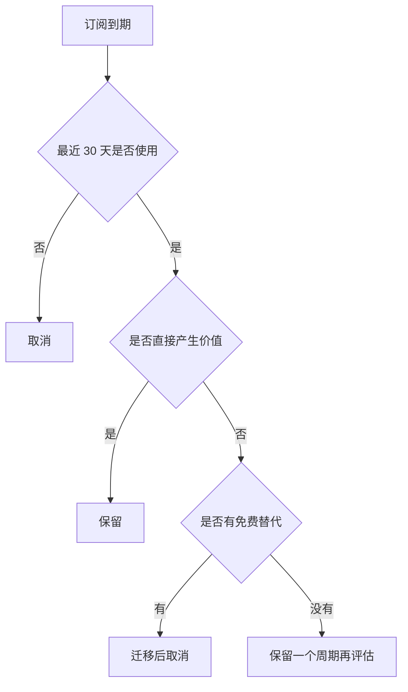

# 订阅与软件成本

## 当前订阅
| 服务 | 用途 | 周期 | 金额/月 | 续费日 | 是否保留 | 备注 |
| --- | --- | --- | ---: | --- | :---: | --- |
| AI 服务 | 写作、代码、笔记整理 | 月付 | 100 | 每月 4 日 | 是 | 与 Idea Note 助手配合 |
| 云服务器 | 测试部署 | 月付 | 88 | 每月 3 日 | 是 | 可降配 |
| 音乐会员 | 听歌 | 年付折算 | 15 | 2026-11-20 | 是 | 家庭共享 |
| 网盘 | 备份 | 年付折算 | 25 | 2027-01-05 | 是 | 重要 |
| 设计素材 | 临时项目 | 月付 | 68 | 每月 18 日 | 待定 | 项目结束取消 |

## 成本公式

设五项订阅的月费构成集合 $C=\{c_1,c_2,c_3,c_4,c_5\}=\{100,88,15,25,68\}$（元/月），其中音乐会员与网盘为**年付折算**（年费分别为 180 元与 300 元，折算月费 $\frac{180}{12}=15$、$\frac{300}{12}=25$），全部按年计算，则年化成本为：

$$
\text{年化成本}
= 12\sum_{i=1}^{5} c_i
= \frac{12}{1} \times \left(100+88+\frac{180}{12}+\frac{300}{12}+68\right)
= 12 \times 296
= 3552
$$

若取消设计素材订阅 $c_5=68$，剩余年化成本变为：

$$
\text{年化成本}'
= 12\sum_{i=1}^{4} c_i
= \frac{12}{1} \times \left(100+88+\frac{180}{12}+\frac{300}{12}\right)
= 12 \times 228
= 2736
$$

对应的节省金额与节省比例：

$$
\Delta = 12 \times c_5 = 12 \times 68 = 816,\qquad
\eta = \frac{\Delta}{\text{年化成本}} = \frac{816}{3552} \approx 22.97\%
$$

更一般地，对任意保留集合 $S \subseteq \{1,2,3,4,5\}$，年化成本与节省比例可统一表示为：

$$
\text{年化成本}(S) = 12 \sum_{i \in S} c_i,\qquad
\eta(S) = 1 - \frac{\sum_{i \in S} c_i}{\sum_{i=1}^{5} c_i} = 1 - \frac{\sum_{i \in S} c_i}{296}
$$

例如当 $S=\{1,2,3,4\}$ 时，$\eta(S)=1-\frac{228}{296}\approx 22.97\%$，即每月省下 68 元、每年省下 816 元。

## 续费提醒

- [ ] 2026-07-18 前确认设计素材是否取消
- [ ] 云服务器 7 月底检查 CPU 与流量，用不到就降配
- [ ] AI 服务保留，但记录实际使用场景

## 订阅决策树

```mermaid
flowchart TD
  A[订阅到期] --> B{最近 30 天是否使用}
  B -- 否 --> C[取消]
  B -- 是 --> D{是否直接产生价值}
  D -- 是 --> E[保留]
  D -- 否 --> F{是否有免费替代}
  F -- 有 --> G[迁移后取消]
  F -- 没有 --> H[保留一个周期再评估]
```

## 使用证据

| 服务 | 证据 |
| --- | --- |
| AI 服务 | 生成/整理本工作区笔记，搜索复杂内容 |
| 云服务器 | 测试发布脚本，保存临时构建产物 |
| 网盘 | 备份照片和扫描凭证 |

可能取消项

设计素材订阅。如果 7 月没有实际产出，8 月前取消，不要让“以后可能用”变成固定成本。

